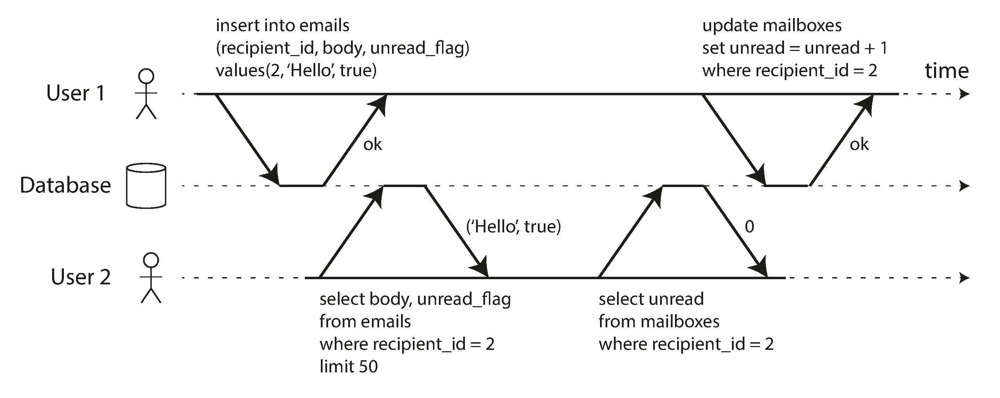
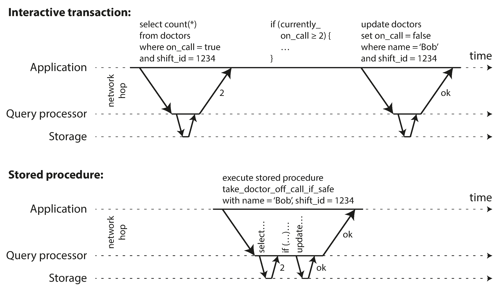

# 7. Transactions

Transaction
:   a way for an application to group several reads and writes together into a logical unit. Conceptually, all the reads and writes in a transaction are executed as one operation: either the entire transaction succeeds (commit) or it fails (abort, rollback).

## The slippery concept of a transaction

There emerged a popular belief that transactions were the antithesis of scalability, and that any large-scale system would have to abandon transactions in order to maintain good performance and high availability. On the other hand, transactional guarantees are some‐
times presented by database vendors as an essential requirement for “serious applica‐
tions” with “valuable data.” Both viewpoints are pure hyperbole.

The truth is not that simple: like every other technical design choice, transactions
have advantages and limitations. In order to understand those trade-offs, let’s go into
the details of the guarantees that transactions can provide—both in normal operation
and in various extreme (but realistic) circumstances.

### The Meaning of ACID

Atomicity
:   Is _not_ about concurrency. It is what happens if a client wants to make several writes, but a fault occurs after some of the writes have been processed. The databse must discard or undo any writes it has made so far. _Abortability_ would have been a better term than _atomicity_.

Consistency
:   _Invariants_ on your data must always be true. The idea of consistency depends on the application's notion of invariants. Atomicity, isolation, and durability are properties of the database, whereas consistency (in an ACID sense) is a property of the application.

Isolation
:   Concurrently executing transactions are isolated from each other. It's also called _serializability_, each transaction can pretend that it is the only transaction running on the entire database, and the result is the same as if they had run _serially_ (one after the other). In practice, serializable isolation is rarely used, because it carries a performance penalty

Durability
:   Once a transaction has committed successfully, any data it has written will not be forgotten, even if there is a hardware fault or the database crashes. In a single-node database this means the data has been written to nonvolatile storage. In a replicated database it means the data has been successfully copied to some number of nodes.

### Single-Object and Multi-Object Operations

To display the number of unread messages for a user, you could query something like:

```SQL
SELECT COUNT(*) FROM emails WHERE recipient_id = 2 AND unread_flag = true
```

However, this query can be slow if there are many emails so you decide to store the number of unread messages in a seperate field (denormalization).



Above, user 2 experiences an anomaly: the mailbox listing shows an unread message, but the counter shows 0 unread messages because the counter increment has not yet happened. Isolation would have prevented this issue by ensuring that user 2 sees both the updates or neither


Above illustrates the need for atomicity: if an error occurs somewhere over the course of the transaction, the contents of the mailbox and the unread counter might become out of sync. In an atomic transaction, if the update to the counter fails, the transaction is aborted and the inserted email is rolled back.

#### Single-object writes

Storage engines almost universally provide atomicity and isolation on the level of a single object. Atomicity can be implemented using a log for crash recovery, and isolation can be implemented using a lock on each object, allowing only one thread to access an object at any one time.

#### The need for multi-object transactions

- In a relational data model, a row in one table often has a foreign key reference in another table. We need to ensure both are updated and valid.
- In a document data model, the fields that need to be updated together are often within the same document, which is trated as a single object. However, document databases lacking join functionality encourage denormalization. Transactions prevent denormalized data from going out of sync.
- In databases with secondary indexes, we must need the indexes to be in sync.

## Weak isolation levels

Concurrency issues (race conditions) come into play when one transaction reads data that is concurrently modified by another transaction, or when two transactions try to simultaneously modify the same data.

Databases have long tried to hide concurrency issues by providing _transaction isolation_.

In practice, is not that simple. Serializable isolation has a performance cost. It's common for systems to use weaker levels of isolation, which protect against _some_ concurrency issues, but not all.

Weak isolation levels used in practice:

### Read committed

It makes two guarantees:

1. When reading from the database, you will only see data that has been committed (no _dirty reads_). Writes by a transaction only become visible to others when that transaction commits.
2. When writing to the database, you will only overwrite data that has been committed (no _dirty writes_). Dirty writes are prevented usually by delaying the second write until the first write's transaction has committed or aborted.

#### Implementing read committed

Most commonly, databases prevent dirty writes by using row-level locks: when a transaction wants to modify a particular object (row or document), it must first acquire a lock on that object. It must then hold that lock until the transaction is committed or aborted.

Databases prevent dirty reads by remembering the old committed value and the new value set by the transaction that currently holds the write lock for every object being written. While the transaction is ongoing, any other transactions that read the object are simply given the old value. Only when the new value is committed do transactions switch over to reading the new value.

### Snapshot Isolation and Repeatable Read

There are still plenty of ways in which you can have concurrency bugs when using read committed isolation. Below is an example.


This anomaly is called _Nonrepeatable read_ or _read skew_, when you read at the same time you committed a change you may see temporal and inconsistent results.

There are some situations that cannot tolerate such temporal inconsistencies:

- **Backups.** During the time that the backup process is running, writes will continue to be made to the database. If you need to restore from such a backup, inconsistencies can become permanent.
- **Analytic queries and integrity checks.** You may get nonsensical results if they observe parts of the database at different points in time.

_Snapshot isolation_ is the most common solution. Each transaction reads from a _consistent snapshot_ of the database. It is good for long-running, read-only queries such as backups and analytics.

#### Implementing snapshot isolation

The implementation of snapshots typically use write locks to prevent dirty writes. However, reads do not require any locks. _Readers never block writers, and writers never block readers_.

The database must potentially keep several different committed versions of an object (_multi-version concurrency control_ or MVCC). Read committed uses a separate snapshot for each query, while snapshot isolation uses the same snapshot for an entire transaction.

Whenever a transaction writes anything to the database, the data it writes is tagged with the transaction ID of the writer.


All writes made by transactions with a later transaction ID are ignored, regardless of whether those transactions have committed.

Snapshot isolation is called _serializable_ in Oracle, and _repeatable read_ in PostgreSQL and MySQL.

### Preventing lost updates

The lost update problem can occur if an application reads some value from the database, modifies it, and writes it back. If two transactions do this concurrently, one of the modifications can be lost (later write _clobbers_ the earlier write).

#### Atomic write operations

A solution for this it to avoid the need to implement read-modify-write cycles and provide atomic operations such as

```sql
UPDATE counters SET value = value + 1 WHERE key = 'foo';
```

Atomic operations are usually implemented by taking an exclusive lock on the object when it is read so that no other transaction can read it until the update has been applied. MongoDB provides atomic operations for making local modifications, and Redis provides atomic operations for modifying data structures.

#### Explicit locking

If the database's built-in atomic operations doesn't provide the necessary functionality, the application explicitly lock objects that are going to be updated.

```sql
SELECT * FROM figures
WHERE name = 'robot' AND game_id = 222
FOR UPDATE;
```

The `FOR UPDATE` clause in SQL queries indicates that the database should take a lock on all rows returned by this query.

#### Automatically detecting lost updates

Allow them to execute in parallel, if the transaction manager detects a lost update, abort the transaction and force it to retry its read-modify-write cycle.

MySQL/InnoDB's repeatable read does not detect lost updates.

#### Compare-and-set

If the current value does not match with what you previously read, the update has no effect.

```SQL
UPDATE wiki_pages SET content = 'new content'
  WHERE id = 1234 AND content = 'old content';
```

#### Conflict resolution and replication

With multi-leader or leaderless replication, compare-and-set do not apply.

A common approach in replicated databases is to allow concurrent writes to create several conflicting versions of a value (also know as _siblings_), and to use application code or special data structures to resolve and merge these versions after the fact.

### Write skew and phantoms

Imagine Alice and Bob are two on-call doctors for a particular shift. Imagine both the request to leave because they are feeling unwell. Unfortunately they happen to click the button to go off call at approximately the same time.


1. A `SELECT` query checks whether some condition is satisfied.
2. If satisfied, the application makes a write and commits. The effect of this write changes the precondition of the decision of 1.

Since database is using snapshot isolation, both checks return 2. Both transactions commit, and now no doctor is on call. The requirement of having at least one doctor has been violated.

_Write skew_ is a generalization of the lost update problem. Write skew can occur if two transactions read the same objects, and then update some of those objects.  In the special case where different transactions update the same object, you get a dirty write or lost
update anomaly (depending on the timing).

Ways to prevent write skew are a bit more restricted:

- Atomic operations don't help as things involve more objects.
- Automatically prevent write skew requires true serializable isolation.
- The second-best option in this case is probably to explicitly lock the rows that the transaction depends on.

  ```sql
  BEGIN TRANSACTION;

  SELECT * FROM doctors
  WHERE on_call = true
  AND shift_id = 1234 FOR UPDATE;

  UPDATE doctors
  SET on_call = false
  WHERE name = 'Alice'
  AND shift_id = 1234;

  COMMIT;
  ```

## Serializability

This is the strongest isolation level. It guarantees that even though transactions may execute in parallel, the end result is the same as if they had executed one at a time, _serially_, without concurrency. Basically, the database prevents _all_ possible race conditions.

There are three techniques for achieving this:

- Executing transactions in serial order
- Two-phase locking
- Serializable snapshot isolation.

### Actual serial execution

The simplest way of removing concurrency problems is to remove concurrency entirely and execute only one transaction at a time, in serial order, on a single thread. This approach is implemented by VoltDB/H-Store, Redis and Datomic.

#### Encapsulating transactions in stored procedures

With interactive style of transaction, a lot of time is spent in network communication between the application and the database.



For this reason, systems with single-threaded serial transaction processing don't allow interactive multi-statement transactions. The application must submit the entire transaction code to the database ahead of time, as a _stored procedure_, so all the data required by the transaction is in memory and the procedure can execute very fast.

There are a few pros and cons for stored procedures:

- Each database vendor has its own language for stored procedures. They usually look quite ugly and archaic from today's point of view, and they lack the ecosystem of libraries.
- It's harder to debug, more awkward to keep in version control and deploy, trickier to test, and difficult to integrate with monitoring.

With stored procedures and in-memory data, executing all transactions on a single thread becomes feasible. As they don’t need to wait for I/O and they avoid the overhead of other concurrency control mechanisms, they can achieve quite good throughput on a single thread.

#### Partitioning

Executing all transactions serially limits the transaction throughput to the speed of a single CPU.

In order to scale to multiple CPU cores you can potentially partition your data and each partition can have its own transaction processing thread. You can give each CPU core its own partition.

For any transaction that needs to access multiple partitions, the database must coordinate the transaction across all the partitions. They will be vastly slower than single-partition transactions.

### Two-phase locking (2PL)

> Two-phase locking (2PL) sounds similar to two-phase _commit_ (2PC) but be aware that they are completely different things.

Several transactions are allowed to concurrently read the same object as long as nobody is writing it. When somebody wants to write (modify or delete) an object, exclusive access is required.

Writers don't just block other writers; they also block readers. Readers block writers. It protects against all the race conditions discussed earlier.

#### Implementation of Two-phase locking

Blocking readers and writers is implemented by a having lock on each object in the database. The lock can either be in _shared mode_ or in _exclusive mode_. The lock is used as follows:

- If a transaction wants to read an object, it must first acquire a lock in shared mode.
- If a transaction wants to write to an object, it must first acquire the lock in exclusive mode.
- If a transaction first reads and then writes an object, it may upgrade its shared lock to an exclusive lock.
- After a transaction has acquired the lock, it must continue to hold the lock until the end of the transaction (commit or abort). **First phase is when the locks are acquired, second phase is when all the locks are released.**

It can happen that transaction A is stuck waiting for transaction B to release its lock, and vice versa (_deadlock_).

**The performance for transaction throughput and response time of queries are significantly worse under two-phase locking than under weak isolation.**

A transaction may have to wait for several others to complete before it can do anything.

Databases running 2PL can have unstable latencies, and they can be very slow at high percentiles. One slow transaction, or one transaction that accesses a lot of data and acquires many locks can cause the rest of the system to halt.

#### Predicate locks

With _phantoms_, one transaction may change the results of another transaction's search query.

In order to prevent phantoms, we need a _predicate lock_. Rather than a lock belonging to a particular object, it belongs to all objects that match some search condition.

Predicate locks applies even to objects that do not yet exist in the database, but which might be added in the future (phantoms). If two-phase locking includes predicate locks, the database prevents all forms of write skew and other race conditions, and so its isolation becomes serializable.

#### Index-range locks

Predicate locks do not perform well. Checking for matching locks becomes time-consuming and for that reason most databases implement _index-range locking_ where a range of values for a particular index is specified.

It's safe to simplify a predicate by making it match a greater set of objects.

These locks are not as precise as predicate locks would be (they may lock a bigger range than necessary), but since they have much lower overheads, they are a good compromise.

### Serializable snapshot isolation (SSI)

It provides full serializability but only has a small performance penalty compared to snapshot isolation. SSI is fairly new and might become the new default in the future.

#### Pesimistic versus optimistic concurrency control

Two-phase locking is called _pessimistic_ concurrency control because if anything might possibly go wrong, it's better to wait.

Serial execution is _pessimistic_ to the extreme as is equivalent to each transaction having an exclusive lock on the entire database.

Serializable snapshot isolation is _optimistic_ concurrency control technique. Instead of blocking if something potentially dangerous happens, transactions continue anyway, in the hope that everything will turn out all right. The database is responsible for checking whether anything bad happened. If so, the transaction is aborted and has to be retried.

It performs badly if there is high contention (many transactions trying to access the same objects) as this leads to a high number of transaction aborts. If there is enough spare capacity, and if contention between transactions is not too high, optimistic concurrency control techniques tend to perform better than pessimistic ones.

SSI is based on snapshot isolation, reads within a transaction are made from a consistent snapshot of the database. On top of snapshot isolation, SSI adds an algorithm for detecting serialization conflicts among writes and determining which transactions to abort.

#### Decisions based on an outdated premise

As seen in the hospital oncall example, under snapshot isolation, the result from the original query may no longer be up-to-date by the time the transaction commits, because the data may have been modified in the meantime. The transaction is taking an action based on a premise.

The database knows which transactions may have acted on an outdated premise and need to be aborted by:

- **Detecting reads of a stale MVCC object version.** The database needs to track when a transaction ignores another transaction's writes due to MVCC visibility rules. When a transaction wants to commit, the database checks whether any of the ignored writes have now been committed. If so, the transaction must be aborted.
- **Detecting writes that affect prior reads.** As with two-phase locking, SSI uses index-range locks except that it does not block other transactions. When a transaction writes to the database, it must look in the indexes for any other transactions that have recently read the affected data. It simply notifies the transactions that the data they read may no longer be up to date.

#### Performance of serializable snapshot isolation

Compared to two-phase locking, the big advantage of SSI is that one transaction doesn't need to block waiting for locks held by another transaction. Writers don't block readers, and vice versa. This design principle makes query latency much more predictable and less variable. In
particular, read-only queries can run on a consistent snapshot without requiring any locks, which is very appealing for read-heavy workloads

Compared to serial execution, SSI is not limited to the throughput of a single CPU core. Transactions can read and write data in multiple partitions while ensuring serializable isolation.

The rate of aborts significantly affects the overall performance of SSI. SSI requires that read-write transactions be fairly short (long-running read-only transactions may be okay).
