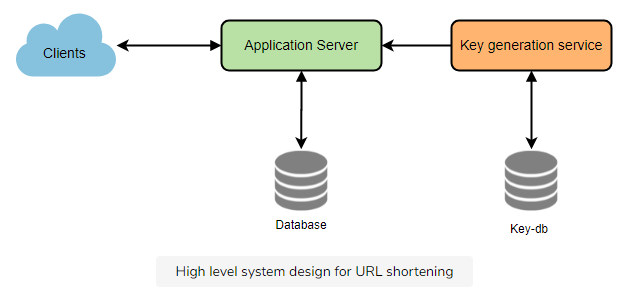

# Key Generation Service

A lot of times we have a problem that needs to create a unique id for a given input. Doing this at run time may be costly. Lets discuss both approaches and the tradeoffs.

## MySQL Auto Incrementing Columns

- MySQL auto-incrementing columns for primary keys, howver MySQL can’t guarantee uniqueness across physical and logical databases.
- Two servers, one generating odd keys, one generating even keys. Prevents single point of failure.
- <https://code.flickr.net/2010/02/08/ticket-servers-distributed-unique-primary-keys-on-the-cheap/>
- Bottleneck as requests to DB can become overloaded if we have enough TPS. Can't generate keys fast enough.

```
TicketServer1:
auto-increment-increment = 2
auto-increment-offset = 1

TicketServer2:
auto-increment-increment = 2
auto-increment-offset = 2
```

## Snowflake IDs

- Have distributed service of machines that generate IDs with following schema
  - Time - 41 bits (millisecond precision) (41 bits lets you have 1 Trillion seconds which is 1M years)
  - Machine Id - 11 bits
  - Sequence number - 12 bits - 2000 events per this millisecond
- Reset sequence number every second
- Performance still degrated by the roundtrips to the ID server. However this delay is considerably less than flushing objects in MySQL.
- If we make our TweetID 64bits (8 bytes) long, we can easily store tweets for the next 100 years and also store them for mili-seconds granularity.

In the above approach, we still have to query all the servers for timeline generation, but our reads (and writes) will be substantially quicker.

1. Since we don't have any secondary index (on creation time) this will reduce our write latency.
2. While reading, we don't need to filter on creation-time as our primary key has epoch time included in it.

## Encoding actual URL

We can compute a unique hash (e.g., [MD5](https://en.wikipedia.org/wiki/MD5) or [SHA256](https://en.wikipedia.org/wiki/SHA-2), etc.) of the given URL. The hash can then be encoded for display. This encoding could be base36 ([a-z ,0-9]) or base62 ([A-Z, a-z, 0-9]) and if we add '+' and '/' we can use [Base64](https://en.wikipedia.org/wiki/Base64#Base64_table) encoding. A reasonable question would be, what should be the length of the short key? 6, 8, or 10 characters?

Using base64 encoding, a 6 letters long key would result in 64^6 = ~68.7 billion possible strings.\
Using base64 encoding, an 8 letters long key would result in 64^8 = ~281 trillion possible strings.

With 68.7B unique strings, let's assume six letter keys would suffice for our system.

If we use the MD5 algorithm as our hash function, it will produce a 128-bit hash value. After base64 encoding, we'll get a string having more than 21 characters (since each base64 character encodes 6 bits of the hash value). Now we only have space for 6 (or 8) characters per short key; how will we choose our key then? We can take the first 6 (or 8) letters for the key. This could result in key duplication; to resolve that, we can choose some other characters out of the encoding string or swap some characters.

**What are the different issues with our solution?** We have the following couple of problems with our encoding scheme:

1. If multiple users enter the same URL, they can get the same shortened URL, which is not acceptable.
2. What if parts of the URL are URL-encoded? e.g., <http://www.educative.io/distributed.php?id=design>, and <http://www.educative.io/distributed.php%3Fid%3Ddesign> are identical except for the URL encoding.

**Workaround for the issues**: We can append an increasing sequence number to each input URL to make it unique and then generate its hash. We don't need to store this sequence number in the databases, though. Possible problems with this approach could be an ever-increasing sequence number. Can it overflow? Appending an increasing sequence number will also impact the performance of the service.

Another solution could be to append the user id (which should be unique) to the input URL. However, if the user has not signed in, we would have to ask the user to choose a uniqueness key. Even after this, if we have a conflict, we have to keep generating a key until we get a unique one.


## Generating keys offline

We can have a standalone **Key Generation Service** (KGS) that generates random six-letter strings beforehand and stores them in a database (let's call it key-DB). Whenever we want to shorten a URL, we will take one of the already-generated keys and use it. This approach will make things quite simple and fast. Not only are we not encoding the URL, but we won't have to worry about duplications or collisions. KGS will make sure all the keys inserted into key-DB are unique

**Can concurrency cause problems?** As soon as a key is used, it should be marked in the database to ensure that it is not used again. If there are multiple servers reading keys concurrently, we might get a scenario where two or more servers try to read the same key from the database. How can we solve this concurrency problem?

Servers can use KGS to read/mark keys in the database. KGS can use two tables to store keys: one for keys that are not used yet, and one for all the used keys. As soon as KGS gives keys to one of the servers, it can move them to the used keys table. KGS can always keep some keys in memory to quickly provide them whenever a server needs them.

For simplicity, as soon as KGS loads some keys in memory, it can move them to the used keys table. This ensures each server gets unique keys. If KGS dies before assigning all the loaded keys to some server, we will be wasting those keys--which could be acceptable, given the huge number of keys we have.

KGS also has to make sure not to give the same key to multiple servers. For that, it must synchronize (or get a lock on) the data structure holding the keys before removing keys from it and giving them to a server.

**What would be the key-DB size?** With base64 encoding, we can generate 68.7B unique six letters keys. If we need one byte to store one alpha-numeric character, we can store all these keys in:

6 (characters per key) * 68.7B (unique keys) = 412 GB.

**Isn't KGS a single point of failure?** Yes, it is. To solve this, we can have a standby replica of KGS. Whenever the primary server dies, the standby server can take over to generate and provide keys.

**Can each app server cache some keys from key-DB?** Yes, this can surely speed things up. Although, in this case, if the application server dies before consuming all the keys, we will end up losing those keys. This can be acceptable since we have 68B unique six-letter keys.

**How would we perform a key lookup?** We can look up the key in our database to get the full URL. If it's present in the DB, issue an "HTTP 302 Redirect" status back to the browser, passing the stored URL in the "Location" field of the request. If that key is not present in our system, issue an "HTTP 404 Not Found" status or redirect the user back to the homepage.

**Should we impose size limits on custom aliases?** Our service supports custom aliases. Users can pick any 'key' they like, but providing a custom alias is not mandatory. However, it is reasonable (and often desirable) to impose a size limit on a custom alias to ensure we have a consistent URL database. Let's assume users can specify a maximum of 16 characters per customer key (as reflected in the above database schema).



## Existing Solutions

### UUID

[UUIDs](https://en.wikipedia.org/wiki/Universally_unique_identifier) are 128-bit hexadecimal numbers that are globally unique. The chances of the same UUID getting generated twice is negligible.

The problem with UUIDs is that they are very big in size and don't index well. When your dataset increases, the index size increases as well and the query performance takes a hit.

### Twitter Snowflake

[Twitter snowflake](https://github.com/twitter/snowflake/tree/snowflake-2010) is a dedicated network service for generating 64-bit unique IDs at high scale. The IDs generated by this service are roughly time sortable.

The IDs are made up of the following components:

- Epoch timestamp in millisecond precision - 41 bits (gives us 69 years with a custom epoch)
- Configured machine id - 10 bits (gives us up to 1024 machines)
- Sequence number - 12 bits (A local counter per machine that rolls over every 4096)

The extra 1 bit is reserved for future purposes. Since the IDs use timestamp as the first component, they are time sortable.

The IDs generated by twitter snowflake fits in 64-bits and are time sortable, which is great. That's what we want.

But If we use Twitter snowflake, we'll again be introducing another component in our infrastructure that we need to maintain.
