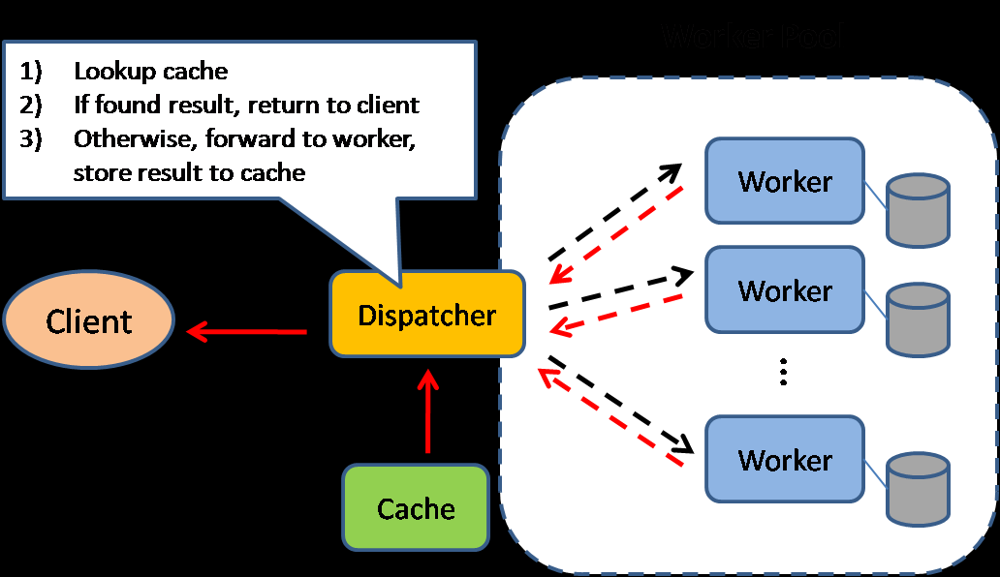
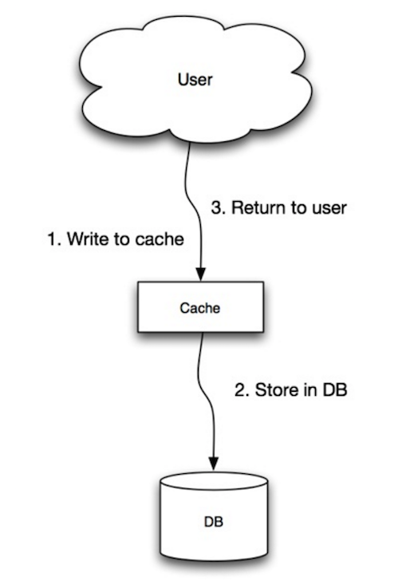
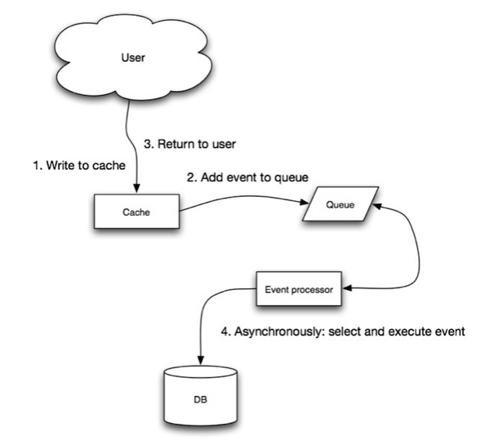

# Cache



Caching improves page load times and can reduce the load on your servers and databases. In this model, the dispatcher will first lookup if the request has been made before and try to find the previous result to return, in order to save the actual execution.

Databases often benefit from a uniform distribution of reads and writes across its partitions. Popular items can skew the distribution, causing bottlenecks. Putting a cache in front of a database can help absorb uneven loads and spikes in traffic.

## When to update the cache

Since you can only store a limited amount of data in cache, you'll need to determine which cache update strategy works best for your use case.

### Cache-aside


The application is responsible for reading and writing from storage. The cache does not interact with storage directly. The application does the following:

- Look for entry in cache, resulting in a cache miss
- Load entry from the database
- Add entry to cache
- Return entry

**Memcached** is generally used in this manner.

Subsequent reads of data added to cache are fast. Cache-aside is also referred to as lazy loading. Only requested data is cached, which avoids filling up the cache with data that isn't requested.

#### Disadvantage(s): cache-aside

- Each cache miss results in three trips, which can cause a noticeable delay.
- Data can become stale if it is updated in the database. Need TTL or cache invalidation.
- When a node fails, it is replaced by a new, empty node, increasing latency.

### Write-through



The application uses the cache as the main data store, reading and writing data to it, while the cache is responsible for reading and writing to the database:

- Application adds/updates entry in cache
- Cache synchronously writes entry to data store
- Return

Application code:

```source-python
set_user(12345, {"foo":"bar"})
```

Cache code:

```source-python
def set_user(user_id, values):
    user = db.query("UPDATE Users WHERE id = {0}", user_id, values)
    cache.set(user_id, user)
```

Write-through is a slow overall operation due to the write operation, but subsequent reads of just written data are fast. Users are generally more tolerant of latency when updating data than reading data. Data in the cache is not stale.

#### Disadvantage(s): write through

- When a new node is created due to failure or scaling, the new node will not cache entries until the entry is updated in the database. Cache-aside in conjunction with write through can mitigate this issue.
- Most data written might never be read, which can be minimized with a TTL.

### Write-behind (write-back)



In write-behind, the application does the following:

- Add/update entry in cache
- Asynchronously write entry to the data store, improving write performance

#### Disadvantage(s): write-behind

- There could be data loss if the cache goes down prior to its contents hitting the data store.
- It is more complex to implement write-behind than it is to implement cache-aside or write-through.

## [](https://github.com/donnemartin/system-design-primer#disadvantages-cache)Disadvantage(s): cache

- Need to maintain consistency between caches and the source of truth such as the database through [cache invalidation](https://en.wikipedia.org/wiki/Cache_algorithms).
- Cache invalidation is a difficult problem, there is additional complexity associated with when to update the cache.
- Need to make application changes such as adding Redis or memcached.
