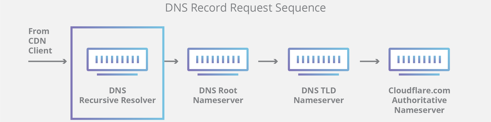

# DNS

A Domain Name System (DNS) translates a domain name such as [www.example.com](http://www.example.com/) to an IP address.

DNS is hierarchical, with a few authoritative servers at the top level. Your router or ISP provides information about which DNS server(s) to contact when doing a lookup. Lower level DNS servers cache mappings, which could become stale due to DNS propagation delays. DNS results can also be cached by your browser or OS for a certain period of time, determined by the [time to live (TTL)](https://en.wikipedia.org/wiki/Time_to_live).

- NS record (name server) - Specifies the DNS servers for your domain/subdomain.
- MX record (mail exchange) - Specifies the mail servers for accepting messages.
- A record (address) - Points a name to an IP address.
- CNAME (canonical) - Points a name to another name or `CNAME` (example.com to [www.example.com](http://www.example.com/)) or to an `A` record.

Services such as [CloudFlare](https://www.cloudflare.com/dns/) and [Route 53](https://aws.amazon.com/route53/) provide managed DNS services. Some DNS services can route traffic through various methods:

- [Weighted round robin](https://www.g33kinfo.com/info/round-robin-vs-weighted-round-robin-lb)
  - Prevent traffic from going to servers under maintenance
  - Balance between varying cluster sizes
  - A/B testing
- [Latency-based](https://docs.aws.amazon.com/Route53/latest/DeveloperGuide/routing-policy.html#routing-policy-latency)
- [Geolocation-based](https://docs.aws.amazon.com/Route53/latest/DeveloperGuide/routing-policy.html#routing-policy-geo)

## Disadvantage(s): DNS

- Accessing a DNS server introduces a slight delay, although mitigated by caching described above.
- DNS server management could be complex and is generally managed by [governments, ISPs, and large companies](http://superuser.com/questions/472695/who-controls-the-dns-servers/472729).

## Deep Dive : CloudFlare

There are 4 DNS servers involved in loading a webpage:

-   [DNS recursor](https://www.cloudflare.com/learning/dns/dns-server-types#recursive-resolver) - The recursor can be thought of as a librarian who is asked to go find a particular book somewhere in a library. The DNS recursor is a server designed to receive queries from client machines through applications such as web browsers. Typically the recursor is then responsible for making additional requests in order to satisfy the client's DNS query.
-   Root nameserver - The [root server](https://www.cloudflare.com/learning/dns/glossary/dns-root-server/) is the first step in translating (resolving) human readable host names into IP addresses. It can be thought of like an index in a library that points to different racks of books - typically it serves as a reference to other more specific locations.
-   [TLD nameserver](https://www.cloudflare.com/learning/dns/dns-server-types#tld-nameserver) - The top level domain server ([TLD](https://www.cloudflare.com/learning/dns/top-level-domain/)) can be thought of as a specific rack of books in a library. This nameserver is the next step in the search for a specific IP address, and it hosts the last portion of a hostname (In example.com, the TLD server is "com").
-   [Authoritative nameserver](https://www.cloudflare.com/learning/dns/dns-server-types#authoritative-nameserver) - This final nameserver can be thought of as a dictionary on a rack of books, in which a specific name can be translated into its definition. The authoritative nameserver is the last stop in the nameserver query. If the authoritative name server has access to the requested record, it will return the IP address for the requested hostname back to the DNS Recursor (the librarian) that made the initial request.