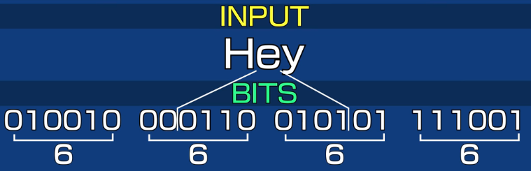
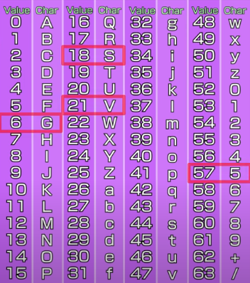

# Encoding And Decoding

Data is made up of bits, 0 or 1. 8 bits = Byte. 256 distinct arrangements (2^8).  

ASCII is a way to map a byte to a character or a symbol. ASCII only has 7 bits, so only 128 possible characters. Extended ASCII was created to make it 8 bits. If network only uses 7 bits,we don't have a way to send our 8 bits over the network. Base64 addresses this problem.

## Base64




Basically, 3 blocks of 8 bits get converted into 4 blocks of 6 bits. Now we have 6 bit groups, 2^64, where base64 gets its name. Now for ease of explanation, each of these groups of 6 bits are turned into numbers and mapped to the index table. 



Now we have a 7 Bit friendly message `SVG5`. 

```python3

string = 'Hey'
string_bytes = 'Hey'.encode('utf-8')
b'Hey'

b64_encoded_bytes = base64.b64encode(string_bytes)
b'SGV5'

b64_decoded_bytes = base64.b64decode(b64_encoded_bytes)
b'Hey'

```

