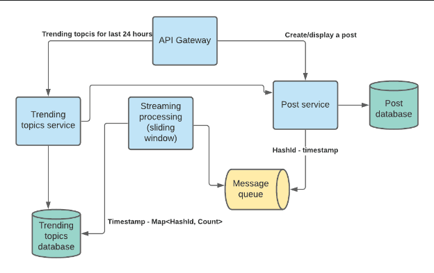
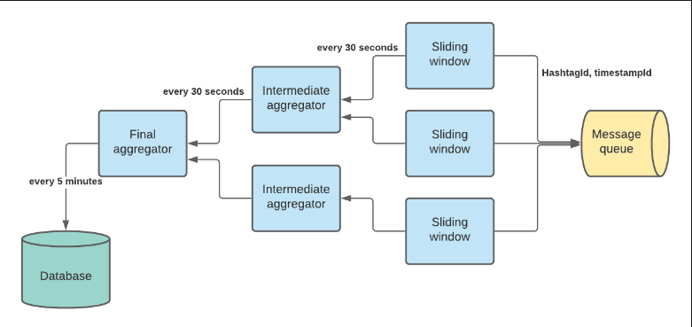

# Trending Topics

## Requirements

- Design "Trending Topics"
- System should be able to ingest hashtags
- What is the timespan for trending topics (1 day, 1 week, etc)? 24 hours
- Do we want real-time trending topics? (streaming or batching)
- Is it just by frequency of occurence, or are there otehr things like weights by influencers?

Use cases:

- User views a page with a hashtag
- User navigates to a "Trending topics" page where hashtags with the most views during the last 24 hours can be found

### Functional/NonFunctional Requirements

- Searching and displaying topics by hashtag
- Storing/viewing the pages with hashtags
- Location specific trending topics
  
Receives request:

```text
GetTrendingTopics:
    Timestamp startTime;
    int periodSeconds;
    int count;
```

- GET /v1/topics/top?count=100&periodSeconds=3600
- Processing service to update.

### Non-Functional Requirements

- Consistency vs availability
  - service must be available [Weak/strong/eventual => consistency | Failover/replication => availability]
- Latency and Throughput requirements?

## Estimations

- 200M daily active users
- Average user 2 tweets per day -> 400M tweets per day
- 3E8/1E5 = 3E3 = ~3000 writes per second. Say peak is 10K QPS
- Say we have 10x more reads than writes (conservative)
- Peak load can have 100K QPS
- We have 120K read events per second to digest by our system

## Bucketsize functional requirements to microservices

**API Gateway**  
Load balancing. SSL termination. Rate limiter. Receives requests from users and depending on geographical location and load redirects the request to stateless frontend service.

**Post Service**  
The service allows users to save and view topics. It uses a cache to get the most recently viewed posts. When the service receives the request to view a topic, we can log this event to the message queue either async or we can use a log and publish this event using an external service running on the same machine.

**Message Queue**  
Receives and delivers information about page views. The reason we want to use the message queue is that we don’t want to affect performance of the topics service with a request that is not needed to get a response with post information.

**Stream Processing**  
We can use Storm and implement a sliding window algorithm to compute the topics  in real time. It aggregates and persists the top trending topics for the last 24 hours. It gets a hashId and a timestamp from the message queue, aggregates them and puts the aggregated trending topics to the database every N minutes (let's say 5 minutes).

**Trending Topics Database**  
`< Timestamp, Sorted List (HashtagId - Count) >`

**Trending topics service**  
Receives request:

```text
GetTrendingTopics:
    Timestamp startTime;
    int periodSeconds;
    int count;
```

It loads all data for this period from the database, aggregates it using a priority queue and returns a response with the list of hashtags and the number of views.

## HLD



We keep the following key-value in the Post database: (Should be renamed hashtags)
`key:hashTagId - value:hashTagName`
In the trending streaming processor we use hashTagId to save some space. Later Trending topics service extract hashtag names from Post service by hashTagId.
We can use Base64 with 8 letter length. 64^8 = (2^6)^8 = 2^48 = (2^10)^5 = (1E3)^5 = 1E15 = 1000T hashtags we can store. Purpose is to reduce # of bytes we send. 

## Deep dive to Trending Service

This is a depth oriented problem.

First thing to clarify is whether we need trending topics for the last 24 hours (or whatever is reasonable time) or for all time using a formula to promote recent topics.

Let's say we want to see trending topics only for the last 24 hours and we also want to keep the history of trending topics.

Let’s take a look at our streaming processing service. If we want to have the latest 100 trending topics, we may use a topology like this:



Sliding window processor reads hashtags and timestamps from message queue and keeps a hashmap like:  
*topicId -> array of timeslots*  
In sliding windowk, data structure is Map<hashId,List(len num of slots in window)>


For example, we could have 10 slots representing 30 seconds each. Every 30 seconds, sum of all slots for each hashId are aggregated and then pushed to intermediate aggregator service. Then latest slot is flushed. Therefore, every 30 seconds, we are reporting last 5 minutes of trending. We can increase granularity as needed. 30 1 second slots reporting 30 second data.

Every 30 seconds we emit an aggregated count for each topic to an intermediate aggregator. We should use shuffling by topic (similar to map/reduce shuffling) so intermediate aggregators always receive information about the same topics. Because intermediate aggregators have all counts for the topic, they can use priority queue to keep only the top 100 topics. Every 30 seconds intermediate aggregators send information about 100 topics to the final aggregator that aggregates top 100 topics across all intermediate aggregators. It also persists the result in the database. There is only 1 final aggregator.

Trending topics service.

It receives the request from API Gateway to get top N (up to 100) trending topics for a given time period. It creates a range query for the given time period and aggregates the result. We can keep the result in cache for several seconds since the query can be expensive and it’s okay to have a little stale data.

## Gather non functional / capacity requirements and check whether and how to scale each tier.

120K events per second. Let’s say we may have 10K unique hashtags per day. 
Let’s consider the Sliding window aggregator. It updates the counter in the hashmap and emits aggregated values every 30 seconds.

### Sliding Window Aggregators

**Memory**  
Memory needed to create a sliding window for 10K unique hashtags (we don’t keep old hashtags and remove them when we emit aggregated counters):  

- hashTagId - long (8 bytes)
- Counter - integer (4 bytes), for 30 seconds we need 30 counters.
- 10K * 8 + 10K * 30 * 4 = 8E4 + 1.2E6 B We may also have hashmap and array overhead so it can be like 2E6 B = 2Mb. It's a pretty small number and the service will not be memory bound.

**Throughput**  
Input data: a server has 200Gb of RAM, 10 cores, 4Tb storage.  
One event size is 8 bytes (timestamp) + 8 bytes (hashtag id) = 16 bytes.  
TCP/IP header is 120 bytes.  
Sliding window aggregators process all data in memory. They read events from the message queue and increment counters. We have 10 cores so we can process 10 events in parallel. 

Processing 1 event should take less than 1ms (lock/unlock 50 ns? + main memory reference ~6*100 ns + read 1k from main memory 250 ns = 1000ns = 1us). Instead of reading a single event at a time from the queue, we can read several events and batch process them:
100 *  1us = 100 us

Reading from the network will take 20 us (1Kb over 1Gb network takes 10 us):
100 * 16 (100 view events) + 120(header) = 1720 ~=2K

Total time to process 100 view events is 120 us. Single thread can process ~=800 events in 1ms and 800K events in 1 second. 

Sending counters to intermediate aggregator:
Size = 1k hashtags * 8 bytes + 1k counters * 4 bytes = 12K = 120us.

In real life there is also some additional overhead for garbage collection (if we use java), creating new sliding windows for new hashtags. Given that let’s assume a single node can digest 100K events per second. Since we need redundancy, we can use 2 or 3 machines for sliding window aggregators.

### Intermediate aggregator

**Memory**  
We keep a priority queue in memory that contains only the top 1000 hashtags and their counter.
1K tags * 8 bytes + 1k counters * 4 bytes = 12K

**Throughput**  
The maximum intermediate aggregator may take 3 requests during 30 seconds. The size of the request is 12K and network latency could be 120us.

The single node can process all view events. But we need at least 2 machines for redundancy.

### Final aggregator

**Memory**  
The same memory size as the Intermediate aggregator. 

**Throughput**  
The same as for the Intermediate aggregator but we need to save the top 1000 topics in the database every 30 seconds. It adds an additional 50 ms to the throughput for every 30 seconds.

The single node can process all requests.
