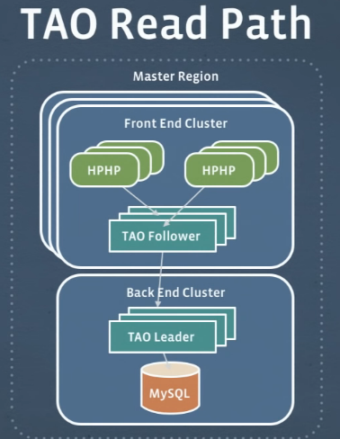
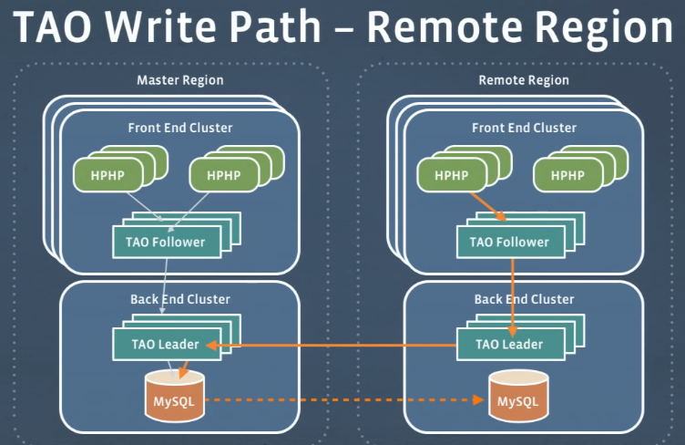
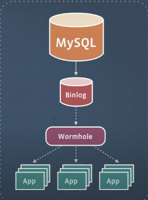
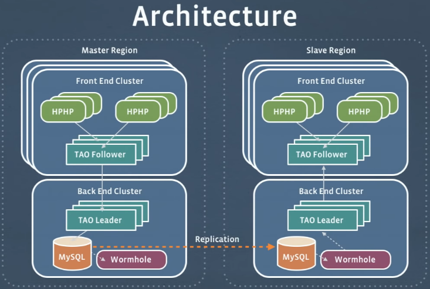

# Large-Scale Low-Latency Storage for the Social Network

<iframe width="560" height="315" src="https://www.youtube.com/embed/5RfFhMwRAic" title="YouTube video player" frameborder="0" allow="accelerometer; autoplay; clipboard-write; encrypted-media; gyroscope; picture-in-picture" allowfullscreen></iframe>

## Messages

- Large historical dataset
- Mostly append data
- Private data
  - Low amount of viewers
- Hbase + caches
  - Hbase works well for write intensive workloads

## Graph Data Challenges

- Low MS resposne times < 1 MS
- Read your own writes
- 1000x reads to writes
- Highly interconnected data
  - Fan out
  - Worldwide scope
- PB of data

## TAO

- Distributed graph storage system
- Read and write through cache

- Many frontend and backend clusters in a region
- TAO serves as L1 and L2 cache
- If data not in TAO Follower, requests data from TAO Leader, which fetches from MySQL
- TAO followers offer redundant copy of data. Serves hottest data. Allows linearly scaling reads by simply adding more TAO followers.
- TAO leaders only have a single copy per region. Less accessed data but prevents load on database and thundering herds.
- TAO is basically write through cache

- Someone from remote region writing data. Follower -> Leader -> Main Leader -> Main SQL -> Async replication to Follower SQL
- Multiple requests in single RPG from Leaders in each region. Helps hide latency by batching.
- Leads into cache consistency model. Since it's write through, cache in posters cluster is immediately updated even before it reaches local database.
- **Requires stickying user to cluster**.

## Wormhole

How does it handle worldwide cache invalidation?

- Pub-sub system
- Subscribe to certain events of data changes
- Tails MySQL binlog consuming SQL comments

Also can be used for ETL to data warehouses. 

## Conclusion

- Social graph data needs WW realtime access
- Distributed caching can hide latency issues
  - But creates consistency solutions
- TAO/MySQL/Wormhole is FB solution