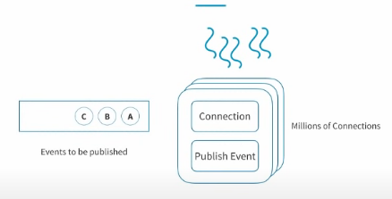
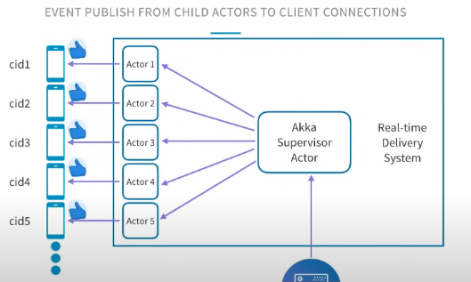
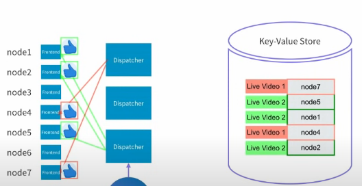

# LinkedIn Real-Time Interactions on Live Video

<iframe width="560" height="315" src="https://www.youtube.com/embed/yqc3PPmHvrA" title="YouTube video player" frameborder="0" allow="accelerometer; autoplay; clipboard-write; encrypted-media; gyroscope; picture-in-picture" allowfullscreen></iframe>

How do likes/comments get distributed to all viewers?

## Challenge 1: The Delivery Pipeline

Sender S sends like to Likes Backend with simple HTTP request. But how does Real time system commuicate with Receiver A? **HTTP Long Polling** and **Server-side Events**

### HTTP Long Polling

Involves keeping an HTTP connection open until the server has data to push to the client. If when the request is made to the server there is no data available yet, the server prolongs the responds while the client waits.

If during this time new data becomes available, it is sent to the client. When data is sent or when the request times out — whichever happens first — a new request is made to reestablish the connection. This is an overhead to keep creating new connections.

### Server-side events

Websockets but only server -> client. If data needs to flow consistently from the server to the client and not the other way around (think: news feeds), a developer might use the **EventSource** interface to allow for server-sent events.

Server-sent events open a single long-lived HTTP connection. The server then unidirectionally sends data when it has it, there is no need for the client to request it or do anything but wait for messages.

## Challenge 2: Connection Management

LinkedIn utilizes **Akka**, a toolkit for building highly concurrent, distributed, and resilient message-driven applications.

Akka *actors* are objects that have State and Behavior. Behavior determines how State should be modified when they receive messages. Each Actor has a mailbox and communicate exclusively by exchanging messages. An actor is assigned a lightweight thread every time there is a message to be processed. That thread will modify the state. Thread is now free to be assigned to next actor. In our case, each actor is managing one persisten connection.

## Challenge 3: Multiple Live Videos

We need to ensure we don't send update to all the connections as they may not be watching the same video. We need a concept of which connection is related to which video.

## Challenge 4: 10K Concurrent Viewers

Add a machine. Now we have more than 1 frontend server. We need a dispatcher to send events to them all. We can send the request to all frontend servers, but this is not efficient. Maybe only 1 server has a subscription related to the video being liked. Therefore we need to know which nodes are serving which videos. We can create another subscription table from video to node. 

## Challenge 5: 100 Likes/second

What's the bottleneck here? The dispatcher.If many events are published it may not keep up. But the current dispatcher nodes store the frontend server subscriptions in memory. Should each node update all the in memory subscriptions of all the dispatchers? No, make that video node subscription table distributed cache using **Redis**.

## Challenge 6: 100 Likes/s, 10K Viewers, Distribution of 1M Likes/s

- Subscription Flow:
  - Viewer subscribes to frontend node.
  - Frontend node stores the subscription in memory subscription table.
  - Frontend subscribes to dispatcher nodes, since dispatcher needs to know which front-end nodes have connections that are subscribed to particular live video. Dispatcher stores this in distributed cache.
- Publish Flow:
  - Viewer likes video. Request sent via HTTP requset to Likes Backend which stores them and sends request to any dispatcher node.
  - Dispatcher node looks into distributed cache to find all nodes to forward request to.
  - Frontend nodes have all connections related to that video in memory. Simply sends update to their subscribed clients.

## Bonus Challenge: Multiple Datacenters

Dispatcher in DC1 must send request also to Dispatcher in DC2 and DC3.
