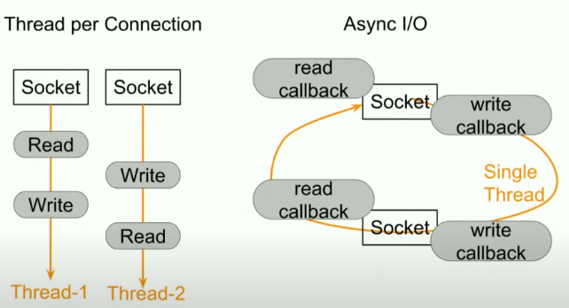

# Scaling Push Messages

<iframe width="560" height="315" src="https://www.youtube.com/embed/6w6E_B55p0E" title="YouTube video player" frameborder="0" allow="accelerometer; autoplay; clipboard-write; encrypted-media; gyroscope; picture-in-picture" allowfullscreen></iframe>

----------------;

- Pull method has tradeoff vs server health and UI freshness. Many unnecessary calls to server or sometimes not many enough.
- Zuul (Netflix notification stack) moved from pull to **Websockets**/**ServerSentEvents**

## Zuul Push Architecture

- Zuul Push Servers sit on network edge and accept incoming client connections
- Client connect to Zuul using Websockets/SSE. Once connected, connection is persistent
- Since we have multiple clients and multiple Zuul Push Servers, we need to keep track of which client is connected to which server. Push Registry handles this
- Push Library need a robust high throughput way to send messages to clients abstracted away from Zuul.
- Message Queue decouple senders and receivers making it easier independently.
  - Allow wide variation in number of incoming messages.
  - Act as buffer absorbing spikes.
- Message Processer reads messages from Message Queue and fetches client id of the message in the Push Registry to find what server to send the message to. Server then sends it to client

## Zuul Push Server

- 10M persistent always on connections. Connections are mostly idle.
- Based on Zuul Cloud Gateway (API Gateway for Netflix)
  - Fronts all HTTP traffic in Netflix ecosystem. 1M req per second
  - **Non Blocking Sync I/O**
- Each client that connects to Zuul Push Server needs to authenticate with Cookies/JWT/Custom scheme before receiving push notifications.

### Non-Blocking Sync I/O to support 10K+ connections per server

- C10K challenge is to support 10K concurrent connections on a single server. Netflix supports more than this on a server. But how?
- Traditional way of network programming cannot be scaled to meet C10K challenge.
  - New thread per incoming connection. Let thread do blocking R/W on that connection.
  - Doesn't scale because will exhaust servers memory allocating 10K stacks for 10K threads. Also CPU will be pinned down by constant context switches.
- Async I/O registers R/W callbacks for many open connections on a single thread.
  - When any connection is ready to do R/W, corresponding callback is invoked on same thread.
  - No longer need # threads == # connections. Scales better
  - **Tradeoff**: Application more complicated. Need to keep track of all state of all connections inside code. Cannot rely on threadstack as its shared. Use Event/State machine in code.
- Netflix uses **Netty** to do Non-Blocking I/O. Used by Cassandra/Hadoop.
  - Channel Inbound/Outbound handler are ~ R/W callbacks.

## Push Registry

Redis used. Cassandra/Dynamo viable alternatives.

- Low read latency
  - Write once per client but Read multiple times.
- Record expiry - TTL
  - When client disconnects cleanly Push Server will take care of cleaning up record from Registry. Not all clients will disconnect cleanly. Clients/Servers crash -> Phantom records in registry. Uses TTL to clean records
- Sharding - High Availability
- Replication - Fault Tolerance

## Message Processing

- Different queues for differnet priorities.
- Multiple instances of message processer to scale throughput.
- Scale # of instances based on # of items in the queue dynamically. 

## Operating Zuul Push : Lessons

### Long lived stable connections

- Great for client efficiency. Terrible for someone operating a server.
  - Terrible for quick deploy/rollback. Say a few nodes in your cluster are now on a new version. How do we get clients to go to the new cluster? Kill the old cluster. But if we do that, all will swarm to new cluster resulting in **Thundering Herd**. Big spike in traffic.
- Solution : **Limit client connection lifetime**.
  - **Autoclose connections from server side and randomize each connection's lifetime.** Without randomness, if there's network blip, many clients drop. Now they all reconnect at same time. If they all get same lifetime, they'll all disconnect/reconnect at same time resulting in recurring Thundering Herds. Randomization fixes this.
- Ask client to close its connection.
  - According to TCP work, closer of connection ends up in *time wait* state. On linux, this can consume the connections file descriptor for upto 2 minutes. If client closes, servers file descriptor is not affected. If client doesn't comply, forcefully close from server.

### Server Size

- Initially chose largest possible size. When server died, resulted in cascading Thundering Herd.
- Used M4.Large 80gb RAM and 2 VCPUs = 24K connections. If few servers goes down, can handle thie increased traffic.
- Efficient operation != # of servers
- Autoscaled based on # of open connections. RPS/CPU not viable metrics since most connections are idle.
  