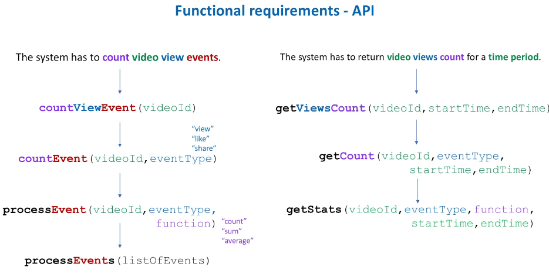
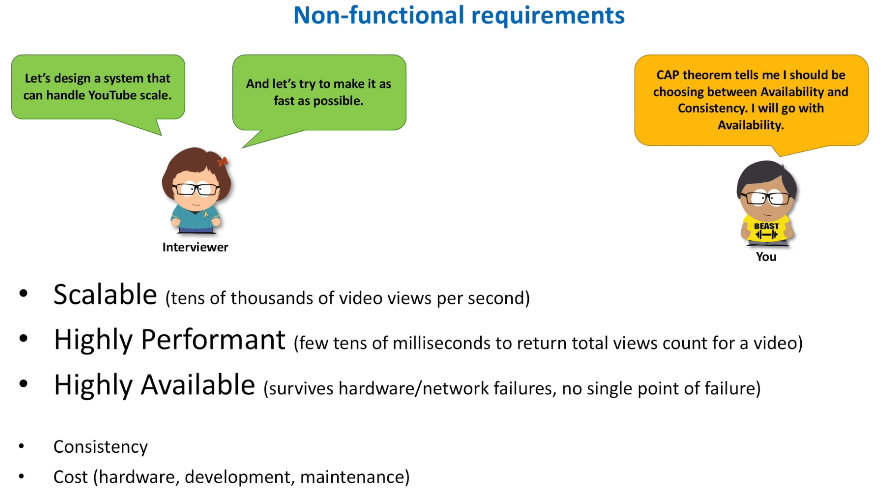
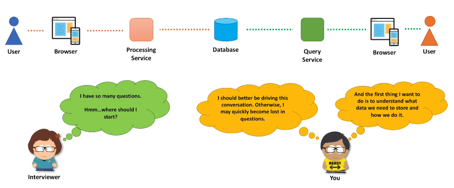
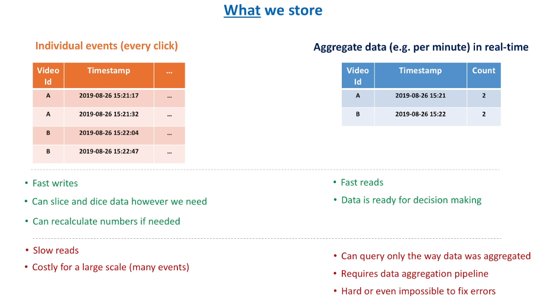
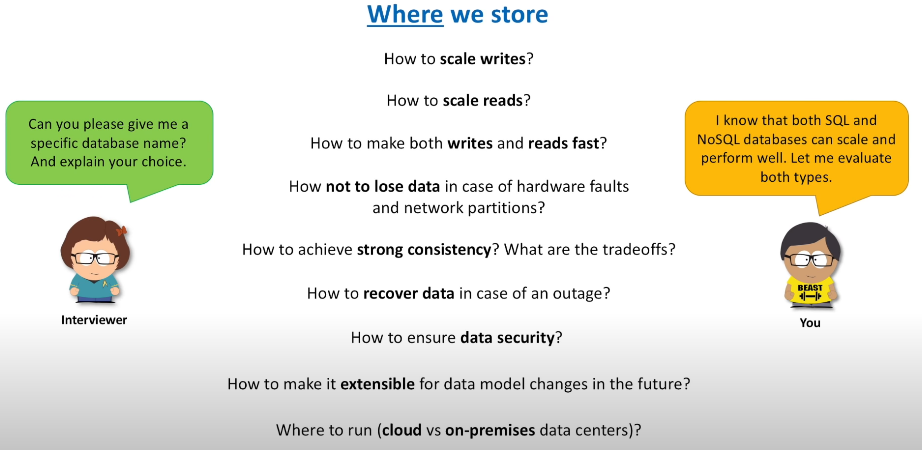
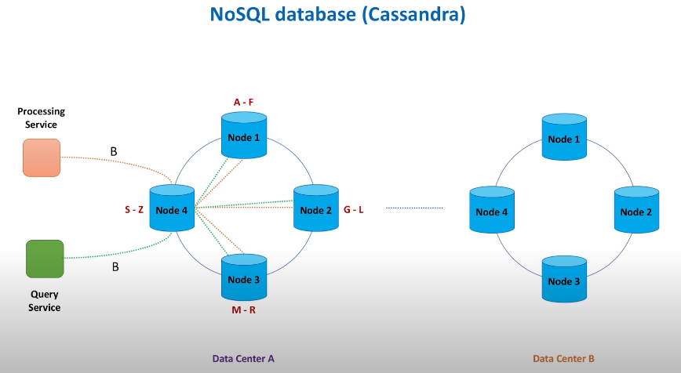
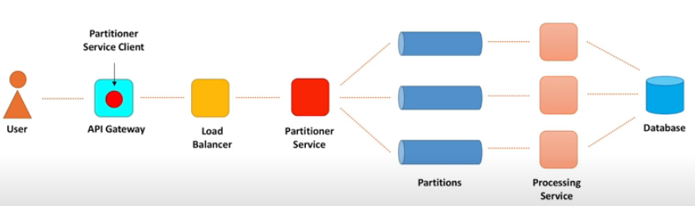
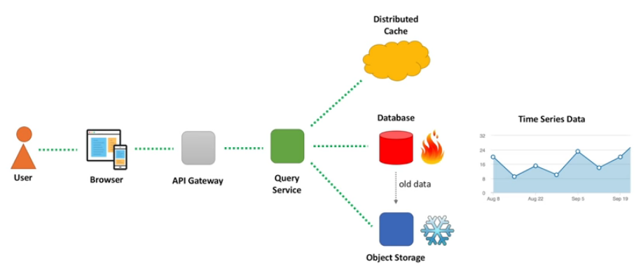

# Step By Step Guide

<iframe width="560" height="315" src="https://www.youtube.com/embed/bUHFg8CZFws" title="YouTube video player" frameborder="0" allow="accelerometer; autoplay; clipboard-write; encrypted-media; gyroscope; picture-in-picture" allowfullscreen></iframe>

------

## Problem Statement / Gathering Requirements

Today we discuss how to count things at a large scale. This could be count number of views on Youtube. More often, the problem will be stated in a general matter. For ex, we need to calculate application performance metrics. Even more generic, analyze data in real time.

What does data analysis mean? Who sends us data? Who uses results of this analysis? What does real time really mean? This and many other questions need to be clarified. Even if problem seems clear to you, there are 2 big reasons why you still need to ask questions.

First, interviewer wants to see how you deal with ambiguity, whether you can identify key pieces of the system and design/scoep the problem. This is why questions are open ended. We should be clear what functional pieces of the problem we will focus on for rest of the interview. There may be many solutions to the problem asked. Only when we understand what features of the system we need to design, we can come up with proper technologies.

Focus questions on 4 big categories:

1. Users/Customers
   1. Who will use the system? All Youtube users? Video owner only? Used by some ML models to generate recommendations.
   2. How will the system be used? Used by marketing department only to generate monthly reports? If so, **data is retrived not often.** Or data is sent to recommendation service in real time. **Data is reterived very often**. Immediately, we have some more ideas about our system.
2. Scale (read/write)
   1. Interviewer will help us define these numbers or maybe we have to calculate these on our own.
   2. We may be given daily # of users and given # actions per user/day and have to go from there.
3. Performance
   1. What is expected write-to-read data delay? If time does not matter, we can use batch data processing. Otherwise, its too slow.
   2. How fast must data be retrieved from the system. If it must be as fast as possible, its a hint we must count views as we write data. Minimal to no counting as we read data. In other words, data must already be aggregated.
4. Cost
   1. Should help us chooes technology stack. For ex, if asked to minimize dev cost, we should lean towards open source frameworks.
   2. If maintanence cost is primary concern, we should use public cloud services.

## Functional Requirements

After figuring out what the system should do, write down in a few sentences what the system has to do. These should include **actions** the system will make. We can expand from initial idea to make API more extensible.

## Non Functional Requirements

Durability can be the 4th requirement after Scalable, Peformant, and Highly Available. Do we favor stale data over no data at all? Question of consistency.

## High Level Architecture

Start with something simple. Database to store data. Web service to processes incoming view events and stores data in the database. To retrieve view count from the database, lets introduce another web service. At this point, we don't have a clear vision of the design so we throw a few high level componenets on the board. High chances interviewer is an expert in the field and knows the Q very well. We may not feel comfortable discussing any componenet just yet. Unless you are an expert, you may not be ready to answer their questions. That's why we need to start with something simple such as **Data**. What data do we want to store and how?

## Data Storage

### Defining A Data Model

Which option should we store? Raw events or aggregate data in real time? This is where we need interviewer to help us make a decision. We should ask about expected data delay. Time between when event happened and when it was processed. If it should be no more than several minutes, we must aggregate data on the fly. If few hours is ok, we can store raw events and process them in the background.

Former approach is known as **stream data processing** while latter is known as **batch data processing**. For sake of this guide, lets choose both options. Btw, combining both approaches makes alot of sense for many systems. We will store raw events and because there are so many of them we will store them for several days or weeks before purging data and sending to longer term storage systems if needed. We will calculate and store numbers in real time so that statistics are available for users right away. By storing both raw events and aggregated data, we get the bost of both worlds. Fast reads, ability to aggregate data differently, and recalculate statistics if there were bugs in real time path.

There is a price to pay for this flexibility. Complexity and cost. Discuss with interviewer.

### Where we store data

Interviewer may ask specific database type / name. We should evaluate both SQL and NoSQL options. This is where Non-Functional requirements come in. Scalability, Availability, and Performance. We should evaluate databases against these requirements. Lets add more requirements along the way.

#### SQL database (MySQL)

Things are simple when we can store all data on a single machine. When its not enough, we need to **shard** or **horizontal partitioning**. Now that we have several machines, services that talk to the database need to know how many machines exist and which one to pick to store and retrieve data.

Instead of making both services call databases directly, we introduce a **Cluster Proxy** that knows about all database machines and routes traffic to the correct shard. How does cluster proxy know when some shard dies or becomes unavailable due to network partition? Or when new shard is added to the database cluster. We introduce a new componenet called **Configuration Service** which maintains a health connection to all shards so that it knows which machines are available. **ZooKeeper** allows **Configuration Service** to know this.  See [ZooKeeper](../Notes/papers/../../../Notes/papers/Cluster%20Management/zookeeper.md). Finally we have **Shard Proxy** which sits infront of a database. It can cache query results, monitor database instance health, and publish metrics.

This setup helps us address Scalability and Performance. But Availability is not yet addressed? What if shard dies? How do we ensure data is not lost?

**Replication**. Replicate the data in other datacenters so if whole DC goes down, we still have data available. So when *store* data request comes, based on information returned by **Configuration Service**, **Cluster Proxy** sends data to a shard. Data is synchronously or asynchronously sent to the replicas. Writes go to leader while reads to go to the followers.

Great, we now know how to scale SQL databases. But this solution doesn't seem simple. We have all this proxies, configuration services, leaders, replicas. Maybe we can simply things. Lets look at what NoSQL can offer us, specifically Apache Cassandra.

#### NoSQL Database (Cassandra)

In NoSQL world we also split data into chunks/shards. Instead of having leaders/followers we say that each shard is equal. We no longer need configuration service to monitor health of each shard. Let's instead allow shards to talk to each other and exchange information about their state. To reduce network load, we don't need each shard to talk to every other shard. Let's instead use a gossip protocl where nodes only talk to few nodes (<3) every second.

This is a big deal. Previously we used **Cluster Proxy** to figure out which shard has which data. Now, all nodes know about each other. Clients may simply call any node in the cluster and the node itself will decide where to forward the request.

Processing Service makes a call to store views count for some video B. Node 4 is selected to serve this request. Choose a node that is closest to teh client in terms of network distance. 4 is now a **Coordinator Node**. **Coordinator Node** needs to decide which node stores data for the requested video. We can use **Consistent Hashing** algorithm to pick the node. Node 1 stores the data for the video B. CN will also replicate data in next 2-3 nodes in consistent hashing ring. Consider idea of **Quorum Read** and **Quorum Write** to determine number of nodes we need for read/write requests to be successful. For high availability, we also create replicas in other data centers. Look at Distributed Cache for Consistent Hashing

4 Types of NoSQL Databases. Column, Document, Key-Value, and Graph.

We chose Cassandra because its fault tolerant, scalable, both read and write throughput increases lineraly as new machines are added. It supports multi datacenter replication and works well with time series data. It is a wide column database that supports asynchronous masterless replication but other NoSQL databases have different architecutres. MongoDB is document oriented with leader base replication. HBase is another column oriented similar to Cassandra with a leader based architecture aswell.

### How we store data

In relational database, data is normalized. We minimize data duplication. NoSQL databases promote different paradigm. We think in terms of queries. Instead of adding rows for every next hour, we add columns.

Great, we have coveraged the storage portion of our design.

## Processing Service

Let's define what processing really means. When YouTube user opens some video, we want total views count for this video to be displayed immediately. It means we need to calculate views count on the fly, in real time. When video owner opens statistics, we need to show per hour counts. So processing basically means we get a video view event and we update 2 counters, total and per hour.

Where to start? As usual, **Start with the Requirements**.

- We want the processing service to scale together with increase in video views.
  - Partitioning
- We don't want to lose data incase of failures.
  - Replicate
- We want to process events quickly.
  - In Memory. Minimize disk reads

Before diving into Processing Service detailed design, lets agree on some basics.

### Data Aggregation Basics

Should we increment data in database for each event or accumulate data in processing service memory and add accumulate value to database counter? Aggregate data in memory is better. Less database writes.

Push or pull? Should something send events synchronously to Processing Service or should Processing Service pull data from temporary storage? Although both work, **Pull option has more advantages** as it provides more fault tolerance support and its easier to scale. Messages can be kept in queue where Processing Service deletes item from storage once it updates in memory counters. If machine crashes, it will never ACK message so it stays in storage. We can use distributed queue such as Kafka or SQS.

This part is optional as Kafka or SQS should provide this functionality for us. When events arrive, we put items in order to storage. Fixed order allows us to assign an offset for each item in storage. Events are always consumed sequentially. Every time event is read, offset moves forward. After we process several events and store them in database, we write checkpoint to persistent storage. If PS fails, we will replace it and it will resume from checkpoint offset. Most likely we dont need FIFO order.

Instead of putting all events into single queue, we create multiple. Assign items to queues based on a hash. **Partitioning allows us to parallelize event processing**. We need to ensure certain hosts only read from certain queues. All "A" videos go to "A" queue which is processed from "A" PS.

### Processing Service Detailed Design

We discussed so far that processing service reads events from partition one by one, counts
events in memory, and flushes this counted values to the database periodically. So, we need a component to read events. Lets say consumer is a single thread. We could use multiple threads but we need to use concurrent hashmaps. The consumer establishes and maintains TCP connection with the partition to fetch data. When consumer reads event it deserializes it. Meaning it converts byte array into the actual object. Consumer does one more important thing - helps to eliminate duplicate events. Usually queues support atleast once delivery. To achieve this we use a distributed cache that stores unique event identifiers for let's say last 10 minutes.

Event then comes to the component that does in-memory counting. Let's call it aggregator.
Think of it as a hash table that accumulates data for some period of time. Periodically, we stop writing to the current hash table and create a new one. A new hash table keeps accumulating incoming data. While old hash table is no longer counting any data and each counter from the old hash table is sent to the internal queue for further processing. Why do we need this internal queue? Why can't we send data directly to the database.

Glad you asked. Remember, we have a single thread that reads events from the partition. But nothing stops us from processing these events by multiple threads, to speed up processing. Especially if processing takes time. However, if we have many threads for readers, we don't need this.

By sending data to the internal queue we **decouple consumption and processing**. You may argue whether we should put internal queue before Aggregator component. Both options are fine.

Ok, we now ready to send pre-aggregated values to the database. So, we need a component responsible for this. Database writer is either a single-threaded or a multi-threaded component. Each thread takes a message from the internal queue and stores pre-aggregated views count in the database. Single-threaded version makes checkpointing easier. But multi-threaded version increases throughput.

Meanwhile, I would like to point out two more important features of the database writer. The first concept is called a **dead letter queue**. The dead-letter queue is the queue to which messages are sent if they cannot be routed to their correct destination. Why do you think we may need one? To protect ourselves from database performance or availability issues. If database becomes slow or we cannot reach database due to network issues, we simply push messages to the dead letter queue. And there is a separate process that reads messages from this queue and sends them to the database.

This concept is widely used when you need to preserve data in case of downstream services
degradation. So, you may apply it in many system designs. Another viable option is to store undelivered messages on a local disk of the processing service machine.

The second concept is data enrichment. Remember how we store data in Cassandra? We store it the way data is queried, right? If we want for example to show video title in the report, we need to store video title together with views count. The same is true for the channel name and many other attributes that we may want to display. But all these attributes do not come to the processing service with every video view event. Event contains minimum information, like video identifier and timestamp. It does not need to contain video title or channel name or video creation date. So, these information comes from somewhere else, right? Some database.

But the trick here is that this database lives on the same machine as the processing service.
All these additional attributes should be retrieved from this database really quickly. Thus, having it on the same machine eliminates a need for remote calls. Such databases are called embedded databases.

One last concept I would like to mention is state management. We keep counters in memory for some period of time. Either in in-memory store or internal queue. And every time we keep anything in memory we need to understand **what to do when machine fails and this in-memory state is lost**. But that is easy, you may say. We have events stored in the partition, let's just re-create the state from the point where we failed. In other words we just re-process events one more time.

This is a good idea. And it will work well if we store data in-memory for a relatively short period of time and state is small. Sometimes it may be hard to re-create the state from raw events from scratch. The solution in this case is to periodically save the entire in-memory data to a durable storage. And new machine just re-loads this state into its memory when started.

## Data Ingestion Path

We know already that we have a set of partitions and processing service reads events from them, count data in memory for some short period of time and stores total count in the database. Someone needs to distribute data across partitions, right?

Let's have a component called **Partitioner service**. Let's also have a **load balancer** component in front of our partitioner service to evenly distribute events across partitioner service machines. When user opens a video, request goes through **API Gateway**, component that represents a single-entry point into a video content delivery system. API Gateway routes client requests to backend services. Our counting system may be one of such backend services.And one more important component to mention is the **partitioner service client**.

We talked about database and processing service in details. Now let's cover remaining 3 components of the data ingestion path: partitioner service client, load balancer and partitioner service.

### Partitioner Service Client

#### Blocking vs Non-Blocking I/O

When client makes a request to a server, server processes the request and sends back a response. The client initiates the connection by using sockets .When a client makes a request, the socket that handles that connection on the server side is blocked. This happens within a single execution thread. So, the thread that handles that connection is blocked as well. And when another client sends a request at the same time, we need to create one more thread to process that request. This is how **blocking systems** work. They create one thread per connection. Modern multi-core machines can handle hundreds of concurrent connections each. But let's say server starts to experience a slow down and number of active connections and threads increases. When this happens, machines can go into a death spiral and the whole cluster of machines may die. Remember we designed a **rate limiter** in one of the previous videos. That is exactly why we need rate limiting solutions, to help keep systems stable during traffic peeks.

Alternative to blocking I/O is non-blocking I/O. When we can use a single thread on the server side to handle multiple concurrent connections. Server just queues the request and the actual I/O is then processed at some later point. Piling up requests in the queue are far less expensive than piling up threads. Non-blocking systems are more efficient and as a result has higher throughput.

You may be wondering that if non-blocking systems are so great, why we still have so
many blocking systems out there? The price of non-blocking systems is increased complexity of operations. Blocking systems are easy to debug. In blocking systems we have a thread per request and we can easily track progress of the request by looking into the thread's stack.
Exceptions pop up the stack and it is easy to catch and handle them. We can use thread local variables in blocking systems. All these familiar concepts either do not work at all or work differently in the non-blocking world.

#### Buffering and Batching

There are thousands of video view events happening on Youtube every second. To process all these requests, API Gateway cluster has to be big in size. If we then pass each individual event to the partitioner service, partitioner service cluster of machines has to be big as well. This is not efficient. We should somehow combine events together and send several of them in a single request to the partitioner service. This is what **batching** is about.

Instead of sending each event individually, we first put events into a buffer. We then wait up to several seconds before sending buffer's content or until batch fills up, whichever comes first. **There are many benefits of batching: it increases throughput, it helps to save on cost, request compression is more effective. But there are drawbacks as well. It introduces some complexity both on the client and the server side.** **For example think of a scenario when partitioner service processes a batch request and several events from the batch fail, while other succeed. Should we re-send the whole batch?**

#### Timeouts

**Timeouts** define how much time a client is willing to wait for a response from a server.
We have two types of timeouts: connection timeout and request timeout.
Connection timeout defines how much time a client is willing to wait for a connection
to establish.
Usually this value is relatively small, tens of milliseconds.
Because we only try to establish a connection, no heavy request processing is happening just
yet.
Request timeout happens when request processing takes too much time, and a client is not willing
to wait any longer.

To choose a request timeout value we need to analyze latency percentiles.
For example we measure latency of 1% of the slowest requests in the system.
And set this value as a request timeout.
It means that about 1% of requests in the system will timeout.
And what should we do with these failed requests?
Let's retry them.
May be we just hit a bad server machine with the first request.
And the second attempt may hit a different server machine, increasing our chances to
succeed.
But we should be smart when retry.
Because if all clients retry at the same time or do it aggressively, we may create a so-called
**retry storm event** and overload sever with too many requests.

To prevent this, we should use **exponential backoff and jitter** algorithms.
Exponential backoff algorithm increases the waiting time between retries up to a maximum
backoff time.
We retry requests several times, but wait a bit longer with every retry attempt.
And jitter adds randomness to retry intervals to spread out the load.
If we do not add jitter, backoff algorithm will retry requests at the same time.
And jitter helps to separate retries.
Even with exponential backoff and jitter we may still be in danger of too many retries.
For example when partitioner service is down or degraded.
And majority of requests are retried.

#### Circuit Breaker

The **Circuit Breaker pattern** stops a client from repeatedly trying to execute an operation
that's likely to fail.
We simply calculate how many requests have failed recently and if error threshold is
exceeded we stop calling a downstream service.
Some time later, limited number of requests from the client are allowed to pass through
and invoke the operation.
If these requests are successful, it's assumed that the fault that was previously causing
the failure has been fixed.
We allow all requests at this point and start counting failed requests from scratch.

**The Circuit Breaker pattern also has drawbacks.
For example, it makes the system more difficult to test.
And it may be hard to properly set error threshold and timers.**
By the way, have you noticed that everything we discussed so far has tradeoffs?
None of these concepts is a silver bullet.
This is true for almost all concepts in distributed systems.
We should always know and remember about tradeoffs.

### Load Balancer

#### Software vs Hardware Load Balancing

Hardware load balancers
    Network devices we buy from known organizations. Theses are powerful machines with many CPU cores, memory and they are optimized to handle very high throughput. Millions of requests per second.

Software load balancer
    Software that we install on hardware we choose. We do not need big fancy machines, and many software load balancers are open source. Load balancers provided by public clouds (for example **ELB from AWS**) are examples of software load balancer type as well.

#### Networking Protocols

TCP Load Balancers
    TCP load balancers simply forward network packets without inspecting the content of the packets. This allows TCP load balancers to be super fast and handle millions of requests per second. Think of it as if we established a single end-to-end TCP connection between a client and a server.

HTTP load balancers
    On contrast, terminate the connection. Load balancer gets an HTTP request from a client, establishes a connection to a server and sends request to this server. HTTP load balancer can look inside a message and make a load‑balancing decision based on the content of the message. For example based on a cookie information or a header.

#### Load Balancing Algorithms

Round robin
    Distributes requests in order across the list of servers.

Least connections
    Sends requests to the server with the lowest number of active connections.

Least response time
    Sends requests to the server with the fastest response time.

Hash-based
    Distribute requests based on a key we define, such as the client IP address or the request URL.

#### DNS

Ok, you got it, there are many benefits of using load balancers. Let's return to our original system design problem and address several very specific questions.
Such as

- How does our partitioner service client know about load balancer?
- How does load balancer know about partitioner service machines?
- How does load balancer guarantee high availability? Because it looks like a single point of failure, right?

Here is where we should recall **DNS, Domain Name System**. DNS is like a phone book for the internet. It maintains a directory of domain names and translate them to IP addresses.

We register our partitioner service in DNS, specify domain name, for example partitionerservice.domain.com
and associate it with IP address of the load balancer device. So, when clients hit domain name, requests are forwarded to the load balancer device.

For the load balancer to know about partitioner service machines, we need to explicitly tell
the load balancer the IP address of each machine.
Both software and hardware load balancers provides API to register and unregister servers.
Load balancers need to know which server from the registered list are healthy and which
are unavailable at the moment.
This way load balancers ensure that traffic is routed to healthy servers only.
Load balancer pings each server periodically and if unhealthy server is identified, load
balancer stops to send traffic to it.
It will then resume routing traffic to that server when it detects that the server is
healthy again.

As for high availability of load balancers, they utilize a concept of primary and secondary
nodes.
The primary load balancer accepts connections and serves requests, while the secondary load
balancer monitors the primary.
If, for any reason, the primary load balancer is unable to accept connections, the secondary
one takes over.
Primary and secondary also live in different data centers, in case one data center goes
down.

### Partitioner Service and Partitions

Partitioner service is a web service that gets requests from clients, looks inside each request to retrieve
individual video view events (because remember we batch events on the client side), and routs
each such event (we can also use the word message) to some partition.
But what partitions are? Partitions is also a web service, that gets messages and stores
them on disk in the form of the append-only log file.
So, we have a totally-ordered sequence of messages ordered by time.
This is not a single very large log file, but a set of log files of the predefined size.

#### Partition Strategy

Partitioner service has to use some rule, partition strategy, that defines which partition
gets what messages.
A simple strategy is to calculate a hash function based on some key, let's say video identifier
and chose a machine based on this hash.
**This simple strategy does not work very well with large scale.**
As it may lead to so called "hot partitions".
For example when we have a very popular video or set of videos and all view events for them
go to the same partition.

**One approach to deal with hot partitions is to include event time, for example in minutes,
into partition key.**
All video events within the current minute interval are forwarded to some partition.
Next minute, all events go to a different partition.
Within one minute interval a single partition gets a lot of data, but over several minutes
data is spread more evenly among partitions.

Another solution to hot partitions problem is to **split hot partition into two new partitions**.
To get an idea how this approach might work, remember consistent hashing algorithm and
how adding a new node to the consistent hashing ring splits a range of keys into two new ranges.

And if to push this idea of partition split even further, we may explicitly allocate dedicated
partitions for some popular video channels. All video view events from such channels go to their allocated partitions.
And view events from all other channels never go to those partitions.
These are the powerful techniques and there is little information on the "hot partitions"
topic on the internet.

#### Service Discovery

To send messages to partitions, partitioner service needs to know about every partition.
This is where the concept of service discovery comes on stage.
In the world of microservices there are two main service discovery patterns: server-side
discovery and client-side discovery.

We already looked at server-side discovery when talked about load balancers.
Clients know about load balancer, load balancer knows about server-side instances.
Easy.
But we do not need a load balancer between partitioner service and partitions.
Partitioner service itself acts like a load balancer by distributing events over partitions.
This is a perfect match for the client-side discovery pattern.

With client-side discovery every server instance registers itself in some common place,**named service registry**.
Service registry is another highly available web service, which can perform health checks
to determine health of each registered instance.
Clients then query service registry and obtain a list of available servers.
Example of such registry service is **Zookeeper**.
In our case each partition registers itself in Zookeeper, while every partitioner service
instance queries Zookeeper for the list of partitions. Zookeeper allows watch flag to receive updates in case of changes using ephemeral nodes.

We also discussed client-side service discovery pattern in [Distributed Cache Design](../Problems/distributedCache.md) although we did
not name it there that way
When cache client needs to pick a cache shard that stores the data.
There we discussed several other options as well.

One more option for service discovery is similar to what Cassandra does.
Remember we mentioned before that Cassandra nodes talk to each other?
So, every node in the cluster knows about other nodes.
It means clients only need to contact one node from the server cluster to figure out
information about the whole cluster.

#### Replication

We must not lose events when store them in partitions.
So, when event is persisted in a partition, we need to replicate it.
If this partition machine goes down, events are not lost.
There are three main approaches to replication: **single leader** replication, **multi leader** replication
and **leaderless** replication.

Do you remember where we used single leader replication? When we discussed how to **scale a SQL database**. Do you remember when we talked about leaderless replication? When we discussed how **Cassandra** works, right? So far we did not talk about multi leader replication.

Let me make a separate deep dive into replication topic.
And only mention right now that multi leader replication is mostly used to replicate between
several data centers. So, which approach should we chose for partitions?

Let's go with single leader replication.
Each partition will have a leader and several followers.
We always write events and read them from the leader only.
While a leader stays alive, all followers copy events from their leader.
And if the leader dies, we choose a new leader from its followers.
The leader keeps track of its followers: checks whether the followers are alive and whether
any of the followers is too far behind.
If a follower dies, gets stuck, or falls behind, the leader will remove it from the list of
its followers.

Remember a concept of a quorum write in Cassandra?
We consider a write to be successful, when predefined number of replicas acknowledge
the write.
Similar concept applies to partitions.
When partitioner service makes a call to a partition, we may send response back as soon
as leader partition persisted the message, or only when message was replicated to a specified
number of replicas.
When we write to a leader only, we may still lose data if leader goes down before replication
really happened.
When we wait for the replication to complete, we increase durability of the system, but
latency will increase.
Plus, if required number of replicas is not available at the moment, availability will
suffer.

#### Message Formats

We can use either textual or binary formats for messages.
Popular textual formats are **XML, CSV, JSON**.
Popular binary formats are **Thrift, Protocol Buffers and Avro**.

What's great about textual formats - they are human-readable.
They are well-known, widely supported and heavily used by many distributed systems.
**But for the large scale real-time processing systems binary formats provide much more benefits.**

Messages in binary format are more compact and faster to parse.
And why is this?
As mentioned before, messages contain several attributes, such as video identifier, timestamp,
user related information.
**When represented in JSON format, for example, every message contains field names, which greatly increases total message size.**
**Binary formats are smarter. Formats we mentioned before require a schema.**
**And when schema is defined we no longer need to keep field names.**
**For example Apache Thrift and Protocol Buffers use field tags instead of field names.**
Tags are just numbers and they act like aliases for fields.
Tags occupy less space when encoded.
Schemas are crucial for binary formats.
Message producers (or clients) need to know the schema to serialize the data.
Message consumers (processing service in our case) require the schema to deserialize the
message.
So, schemas are usually stored in some shared database where both producers and consumers
can retrieve them.

Schemas may and will change over time.
We may want to add more attributes into messages and use them later for counting or filtering.
**Apache Avro is a good choice for our counting system.**

## Data Retrieval

When users open a video on Youtube, we need to show total views count for this video. To build a video web page, several web services are called. A web service that retrieves information about the video, a web service that retrieves comments, another one for recommendations. Among them there is our Query web service that is responsible for video statistics.

All these web services are typically hidden behind an API Gateway service, a single-entry
point. API Gateway routes client requests to backend services. So, get total views count request comes to the Query service. We can retrieve the total count number directly from the database. Remember we discussed before how both SQL and NoSQL databases scale for reads.
But total views count scenario is probably the simplest one. This is just a single value in the database per video.

The more interesting use case is when users retrieve time-series data, which is a sequence of data points ordered in time. For example, when channel owner wants to see statistics for her videos. As discussed before, we aggregate data in the database per some time interval, let's say per hour. Every hour for every video. That is a lot of data, right? And it grows over time.

Fortunately, this is not a new problem and solution is known. Monitoring systems, for example, aggregate data for every 1 minute interval or even 1 second. You can imaging how huge those data sets can be. So, we cannot afford storing time series data at this low granularity for a long period of time. The solution to this problem is to **rollup the data**. For example, we store per minute count for several days. After let's say one week, per minute data is aggregated into per hour data. And we store per hour count for several months. Then we rollup counts even further and data that is older than let's say 3 months, is stored with 1 day granularity.

And the trick here is that we do not need to store old data in the database. We keep data for the last several days in the database, but the older data can be stored somewhere else, for example, object storage like AWS S3. In the industry, you may also hear terms like a hot storage and a cold storage.

Hot storage
    Frequently used data that must be accessed fast.

Cold storage
    Doesn’t require fast access. It mostly represents archived and infrequently accessed data.

When request comes to the Query service, it does so-called data federation, when it may need to call several storages to fulfill the request. Most recent statistics is retrieved from the database, while older statistics is retrieved from the Object Storage. Query service then stitches the data. And this is ideal use case for the cache. We should store query results in a distributed cache. This helps to further improve performance of queries and scale them.

## Data Flow Simulation

- Three users opened some video A. And API Gateway got 3 requests.
- Partitioner service client batches all three events and sends them in a single request to the partitioner service.
- This request hits the load balancer first.
- And load balancer routes it to one of the partitioner service machines.
- Partitioner service gets all three events from the request and sends them to some partition
  - All three events end up in the same partition, as we partition data based on the video identifier.
- Here is where processing service appears on the stage.
  - Partition consumer reads all three messages from the partition one by one and sends them to the aggregator.
  - Aggregator counts messages for a one minute period and flushes calculated values to the internal queue at the end of that minute.
  - Database writer picks count from the internal queue and sends it to the database.
  - In the database we store count per hour and the total number of views for each video.
  - So, we just add a one minute value to the current hour count as well as the total count.
  - Total count was 7 prior to this minute and we add 3 for the current minute.
- And during data retrieval, when user opens video A, API Gateway sends request to the Query service.
- Query service checks the cache.
- And if data is not found in the cache, or cache value has expired, we call the database. Total count value is then stored in the cache and Query service returns the total count back to the user. We may need cache invalidation but if we keep low TTL it may be ok to show slightly stale data.

## Other Interview Aspects

Another important aspect of an interview and system design in general is a technology stack. When we design some system, we usually do not need to reinvent the wheel. We rely on some well-regarded technologies. **Either open source or commercial. Public cloud services. During the interview do not forget to discuss these technologies.** You may do this along the way or at the end of the interview. So, let's see what technologies we may use for our solution.

### Client Side
  
- **Netty** is a high-performance non-blocking IO framework for developing network applications, both clients and servers.
- Frameworks such as **Hystrix** from Netflix and **Polly** simplify implementation of many client-side concepts we discussed before: timeouts, retries, circuit breaker pattern.

#### Load Balancers

- **Citrix Netscaler** is probably the most famous hardware load balancer.
- **NGINX** is a very popular software load balancer.
- And if we run our counting system in the cloud, for example Amazon cloud, then **Elastic Load Balancer** is a good pick.
### Messaging Systems
  - Instead of using our custom Partitioner service and partitions, we could use **Apache Kafka** instead. Or Kafka's public cloud counterpart, like **Amazon Kinesis**.
  - To process events and aggregate them in memory we can use stream-processing frameworks such as **Apache Spark** or **Flink**.
  - Or cloud-based solutions, such as **Kinesis Data Analytics**.

### Storage

- We already talked about Apache Cassandra.
- Another popular choice for storing time-series data is **Apache HBase** database.
- These are wide column databases.
- There are also databases optimized for handling time series data, like **InfluxDB**.
- We also mentioned before that we may need to store raw events to recalculate counts in case of any error or if customers need to run ad-hoc queries.
- We can store raw events in **Apache Hadoop** or in a cloud data warehouse, such as **AWS Redshift**. And when we roll up the data and need to archive it, **AWS S3** is a natural choice.

### Other

- **Vitess** is a database solution for scaling and managing large clusters of MySQL instances Vitess has been serving all Youtube database traffic since 2011.
- In several places of our design we rely on a **distributed cache**: for message deduplication and to scale read data queries. **Redis** is a good option.
- For a **dead-letter queue** mechanism, when we need to temporarily queue undelivered messages, we may use an open-source message-broker such as **RabbitMQ**.
  - Or public cloud alternative, such as **Amazon SQS**.
- For data enrichment, when we store video and channel related information locally on the machine and inject this information in real-time, we may use **RocksDB**, a high performance embedded database for key-value data.
- To do **leader election** for partitions and to manage service discovery, we may rely on **Apache Zookeeper**, which is a distributed configuration service.
- For the service discovery piece we actually have an alternative, Eureka web service from Netflix.
- To monitor each of our system design components we may rely on monitoring solutions provided by public cloud services, such as **AWS CloudWatch**.
  - Or use a popular stack of open source frameworks: Elasticsearch, Logstash, Kibana. Or ELK for short.
- We discussed before that binary message format is preferred for our system. 
  - Popular choices are **Thrift, Protobuf and Avro**.
- For Partitioner service to partition the data, we should use a good hashing function, for example a **MurmurHash**.

## Follow Up Questions

We are done with the detailed system design. And here is where our interviewer will start challenging us with the choices we have made. We discussed many tradeoffs of individual components throughout this video. Let's see what else the interviewer may want to discuss with us.

### Bottlenecks

To identify bottlenecks in the system we need to test it under a heavy load. This is what performance testing is about. There are several types of performance testing. We have:

- Load Testing
  - when we measure behavior of a system under a specific expected load.  
- Stress Testing
  - when we test beyond normal operational capacity, often to a breaking point.
- Soak Testing
  - when we test a system with a typical production load for an extended period of time.

With load testing we want to understand that our system is indeed scalable and can handle a load we expect. For example, a two or three times increase in traffic. With stress testing we want to **identify a breaking point** in the system. Which component will start to suffer first. **And what resource it will be: memory, CPU, network, disk IO**. And with soak testing we want to find leaks in resources. For example, memory leaks.So, generating high load is the key. Tools like **Apache JMeter** can be used to generate a desired load. Health monitoring. 

### Health Monitoring

All the components of our system must be instrumented with monitoring of their health. Metrics, dashboards and alerts should be our friends all the time. Metric is a variable that we measure, like error count or processing time. Dashboard provides a summary view of a service’s core metrics. And alert is a notification sent to service owners in a reaction to some issue happening in the service. Remember about the four golden signals of monitoring, which are **latency**, **traffic**, **errors**, and **saturation**.

### Ensure Accurate Results

Ok, we designed a system and deployed all the components. We know it is running healthy and can handle a high load. But how to make sure it counts things correctly? This becomes critical when we not just count video views, but, for example, number of times some ad was played in a video. As we need to properly charge an ad owner and pay money to a video owner.

This problem is typically addressed by building an audit system. There can be two flavors of audit systems. Let's call them weak and strong. **Weak audit system** is a continuosly running end-to-ed test. When let's say once a minute we generate several video view events in the system, call query service and validate that returned value equals to the expected count. This simple test gives us a high confidence that the system counts correctly. And it is easy to implement and maintain such test. But unfortunately, this test is not 100% reliable. What if our system loses events in some rare scenarios? And weak audit test may not identify this issue for a long period of time.

That is why we may need a better approach. **Strong audit system** calculates video views using a completely different path then out main system. For example we store raw events in Hadoop and use MapReduce to count events. And then compare results of both systems. Having two different systems doing almost the same may seem like an overkill, right? You may be surprised but this is not so uncommon in practice. Not such a long time ago it was quite a popular idea. And it even has a name - **Lambda Architecture**.

**The key idea is to send events to a batch system and a stream processing system in parallel.** And stitch together the results from both systems at query time. See [Top K Heavy Hitters](topKHeavyHitters.md)

Ideally, we should have a single system. Let me share with you advice from Jay Kreps, who is one of the authors of Apache Kafka.

- Use a **batch processing** framework like **MapReduce if we aren’t latency sensitive**
- Use a **stream processing** framework if we are, but not to **try to do both at the same
time unless we absolutely must**.

And please note that out today's problem can indeed be solved with MapReduce. But MapReduce-based system would have a much higher latency.

### Avoid Bottleneck with Extremely Popular Videos

We already discussed the problem with popular videos. I will just reiterate the key idea. We have to spread events coming for a popular video across several partitions. Otherwise, a single consumer of a single "hot" partition may not be able to keep up with the load. And will fall behind.

### Situation when the processing service cannot keep up with the load

Maybe because number of events is huge, maybe because processing of a single event is complicated and time consuming.I will not dive too much into details, but describe the main idea of the solution.

- We **batch events and store them in the Object Storage service**, for example AWS S3.
- **Every time we persist a batch of events, we send a message to a message broker.** For example SQS.
- Then we have a big cluster of machines, for example EC2, that retrieve messages from SQS, read a corresponding batch of events from S3 and process each event.
- This approach is a bit slower than stream processing, but faster than batch processing.

## Summary

- We start with requirements clarification.
- And more specifically, we need to define Functional Requirements / APIs, what exactly our system is supposed to do.
- We then discuss non-functional requirements with the interviewer and figure out what qualities of the system she is most interested in.
- We can now outline a high-level architecture of the system.
  - Draw some key components on the whiteboard.
  - At the next stage we should dive deep into several of those components.
  - Our interviewer will help us understand what components we should focus on.
- And the last important step is to discuss bottlenecks and how to deal with them.

### Functional Requirements / API

To define APIs, we discuss with the interviewer what specific behaviors or functions of the
system we need to design. We write down verbs characterizing these functions and start thinking about input parameters and return values. We then can make several iterations to brush up the APIs. After this step we should be clear on what the scope of the design is.

### NonFunctional Requirements

To define non-functional requirements, just know what your options are. Open a list of non-functional requirements on wiki and read the list. There are many of them.
I recommend to focus on **scalability**, **availability** and **performance**.
Among other popular choices we have **consistency**, **durability**, maintainability and cost.
Try to pick not more than 3 qualities.

### HLD

To outline a high-level design, think about how data gets into the system, how it gets
out of the system and where data is stored inside the system. Draw these components on the whiteboard. It is ok to be rather generic at this stage. Details will follow later.
And although it is not easy, try to **drive the conversation**. Our goal here is to get understanding of what components to focus on next. And the interviewer will help us.

### Detailed Design

While designing specific components, **start with data**.
How it is stored, transferred and processed.
Here is where our knowledge and experience becomes critical.
By using fundamental concepts of system design and by knowing how to combine these concepts
together, we can make small incremental improvements.
And apply relevant technologies along the way.

After technical details are discussed, we can move to discussing other important aspects
of the system.
Listen carefully to the interviewer.
She sees bottlenecks of our design and in her questions there will be hints what those
bottlenecks are.
And what can really help us here is the knowledge of different tradeoffs in system design.
We just need to pick and apply a proper one.

Although we talked about a specific problem today, like video views counting, the same
ideas can be applied to other problems, for example counting likes, shares, reposts, ad
impressions and clicks. The same ideas can be applied to designing monitoring systems, when we count metrics. When we design a fraud prevention system we need to count number of times each credit card was used recently. When we design recommendation service we may use counts as input to machine learning models. When we design "what's trending" service, we count all sorts of different reactions: views, re-tweets, comments, likes. And many other applications.
