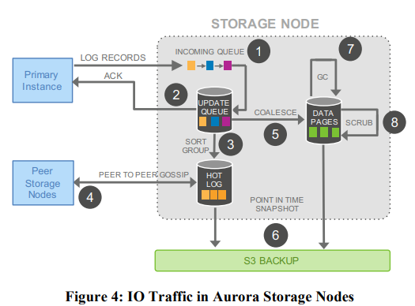

# [Amazon Aurora: Design Considerations for High Throughput Cloud-Native Relational Databases](http://nil.csail.mit.edu/6.824/2020/papers/aurora.pdf)

*A cloud-native relational database service for OLTP workloads.*

MIT [Notes](http://nil.csail.mit.edu/6.824/2020/notes/l-aurora.txt) [FAQ](http://nil.csail.mit.edu/6.824/2020/papers/aurora-faq.txt)

## 1. Overview 

- We believe the central constraint in high throughput data processing has moved from compute and storage to the network.
- Aurora uses a novel architecture with a fleet of database instances and storage service. Several database functions(redo logging, crash recovery, etc) are offloaded to the storage service, which is like a virtualized segmented redo log (shared-disk architecture).
- **Aurora uses two big ideas**:
  - Quorum writes for better fault-tolerance without too much waiting
  - Storage servers understand how to apply DB's log to data pages, so only need to send (small) log entries, not (big) dirty pages. Sending to many replicas, but not much data.
    -  The log is the database; any page that the storage system materializes are simply a cache of log application.
- **Three advantages over traditional approaches to traditional distributed databases**
  - First, by building storage as an independent faulttolerant and self-healing service across multiple data-centers, we protect the database from performance variance and transient or permanent failures at either the networking or storage tiers.
  - Second, by only writing redo log records to storage, we are able to reduce network IOPS by an order of magnitude
  - Third, we move some of the most complex and critical functions (backup and redo recovery) from one-time expensive operations in the database engine to continuous asynchronous operations amortized across a large distributed fleet. This yields near-instant crash recovery without checkpointing as well as inexpensive backups that do not interfere with foreground processing. 

## 2. HLD of Architecture

- To tolerate AZ failure, Aurora replicates each data item 6 ways across 3AZs with 2 copies in each AZ.
- Database volume is partitioned into 10GB segments. Each segment is replicated 6 times into a Protection Group.
- The only writes that cross the network are redo log records, so network load is drastically reduced despite amplifying write for replication.
- Storage nodes gossips with peers to fill gaps in received log records. Durable log application happens at the storage nodes continuously and  asynchronously.
- Each log record has a monotonically-increasing Log Sequence Number(LSN).
- Instead of 2PC protocol, Aurora maintains points of consistency and durability and advances them when receiving acknowledgements for storage requests.
  - Durability: the highest LSN at which all prior log records are available.
  - Consistency: each transaction is broken up to mini-transactions, and the final log record in a mini-transaction is a consistency point.
- Normally  read quorum is not needed since the database feeds log records to storage nodes and tracks progress.

:

## 3. Durability

- V nodes, read quorum `V_r`, write quorum `V_w`
  * To ensure each write is aware of the most recent write: `V_w > V/2`
  * Read = max_version(all nodes), so `V_r + V_w > V`, it can ensure the request must be accepted by a node with most update data. Because each log entry have an index/version, we only pick the date with the most updated log.
- AZ (availability zone) level failure tolerance
  - Losing an entire AZ and one additional node (AZ+1) without losing data
  - Losing an entire AZ without impacting the ability to write data
    - `AZ = 3, V = 6, V_w = 4, V_r = 3`
- Database volume is partitioned into 10GB segments. Each segment is replicated 6 times into a Protection Group.

**Advantages of storage server based on quorum mechanism**:

- Smoother handling of server failures, slow execution or network partition problems, because each operation does not require a response from all replica servers (for example, as opposed to chain replication, chain replication needs to wait for write operations to be completed on all replicas)
- Under the premise of satisfying $W+R>V$, *W* and *R* can be adjusted. For different read and write load conditions, if the read load is relatively large, *R* can be reduced, and vice versa

**Raft** also uses the *quorum* mechanism: *leader* will submit the *log entry* only after most copies are written to the *log entry*, but **Raft** is more powerful: it can handle more complex operations (due to its sequential operations); *leader* can be automatically re-elected when a *split-brain* problem occurs

## 4. The Log Is The Database

### 4.1. Database execution process

Paper assumes you know how DB works, how it uses storage. Let's describe the execution process of the write operation of a single-machine general transaction database. 

- The data is stored in the *B-Tree* of the hard disk, and there are cached data pages in the database.
- Take the transaction `x=x+10` `y=y-10` as an example:
- First lock `x` and `y`
- DB server modifies only cached data pages as transaction runs and appends update info to **Write-Ahead Log** (redo log)
- At this time *log entry* can be expressed as:   
  
    | LSID | TID | Key | old | new | Notes |
    | ---- | ---- | ------ | ---- | ---- | -------------------- |
    | 101 | 7 | x | 500 | 510 | x=x+10 |
    | 102 | 7 | y | 750 | 740 | y=y-10 |
    | 103 | 7 | commit | | | transaction finished |

- Release the locks of `x` and `y` after *WAL* is written to the hard disk, and reply to *client* 
- **Log Applicator** acts on the modification of the *log entry* on the before image of the cached data page, which will generate an after image.
  - Delayed writing can optimize performance because the data page is large
- **Crash Recovery**
  - Replay all committed transactions in *log* (**redo**)
  - Roll back all uncommitted transactions in *log* (**undo**)

### 4.2 Aurora Log Processing

In **Aurora**, **Log Procesing** is pushed down to the storage layer to generate data pages in the background or on-demand. The write data transmitted through the network is only **REDO** logs, thus reducing the network load , And provides considerable performance and durability.

  
  

  
  

## Extra Notes

- In shared-disk architecture, all data is shared by all nodes. In shared-nothing architecture, each node manages a subset of data.
- It is hard to use change buffer in shared-disk architecture, so writes are penalized when there are secondary indexes.*
