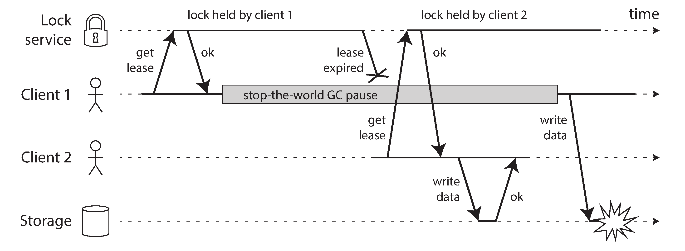

# 8. The Trouble With Distributed Systems

## Faults and Partial Failures

A program on a single computer either works or it doesn't. There is no reason why software should be flaky (non deterministic).

In a distributed systems we have no choice but to confront the messy reality of the physical world. There will be parts that are broken in an unpredictable way, while others work. Partial failures are _nondeterministic_. Things will unpredicably fail.

We need to accept the possibility of partial failure and build fault-tolerant mechanism into the software. **We need to build a reliable system from unreliable components.**

## Unreliable Networks

Focusing on _shared-nothing systems_ the network is the only way machines communicate.

The internet and most internal networks are _asynchronous packet networks_. A message is sent and the network gives no guarantees as to when it will arrive, or whether it will arrive at all. Things that could go wrong:

1. Request lost
2. Request waiting in a queue to be delivered later
3. Remote node may have failed
4. Remote node may have temporarily stoped responding
5. Response has been lost on the network
6. The response has been delayed and will be delivered later

If you send a request to another node and don't receive a response, it is _impossible_ to tell why.

The usual way of handling this issue is a _timeout_: after some time you give up waiting and assume that the response is not going to arrive.

### Detecting Faults

Many systems need to automatically detect faulty nodes. For example

- A load balancer needs to stop sending requests to a node that is dead
- In a distributed database with single-leader replication, if the leader fails, one of the followers needs to be promoted to be the new leader

Nobody is immune to network problems. You do need to know how your software reacts to network problems to ensure that the system can recover from them. It may make sense to deliberately trigger network problems and test the system's response.

If you want to be sure that a request was successful, you need a positive response from the application itself.

If something has gone wrong, you have to assume that you will get no response at all.

### Timeouts and unbounded delays

A long timeout means a long wait until a node is declared dead. A short timeout detects faults faster, but carries a higher risk of incorrectly declaring a node dead (when it could be a slowdown).

Premature declaring a node is problematic, if the node is actually alive the action may end up being performed twice.

When a node is declared dead, its responsibilities need to be transferred to other nodes, which places additional load on other nodes and the network. If the system is already struggling with high load, declaring nodes dead prematurely can make the problem worse. In particular, it could happen that the node actually wasn’t dead but only slow to respond due to overload; transferring its load to other nodes can cause a cascading failure.

### Network congestion and queueing

- Different nodes try to send packets simultaneously to the same destination, the network switch must queue them and feed them to the destination one by one. The switch will discard packets when filled up.
- If CPU cores are busy, the request is queued by the operative system, until applications are ready to handle it.
- In virtual environments, the operative system is often paused while another virtual machine uses a CPU core. The VM queues the incoming data.
- TCP performs _flow control_, in which a node limits its own rate of sending in order to avoid overloading a network link or the receiving node. This means additional queuing at the sender. 
- Moreover, TCP considers a packet to be lost if it is not acknowledged within some
timeout (which is calculated from observed round-trip times), and lost packets are
automatically retransmitted. Although the application does not see the packet loss
and retransmission, it does see the resulting delay (waiting for the timeout to expire,
and then waiting for the retransmitted packet to be acknowledged).

You can choose timeouts experimentally by measuring the distribution of network round-trip times over an extended period.

Systems can continually measure response times and their variability (_jitter_), and automatically adjust timeouts according to the observed response time distribution.

#### TCP vs UDP

Some latency-sensitive applications, such as videoconferencing and Voice over IP
(VoIP), use UDP rather than TCP. It’s a trade-off between reliability and variability
of delays: as UDP does not perform flow control and does not retransmit lost packets,
it avoids some of the reasons for variable network delays (although it is still suscepti‐
ble to switch queues and scheduling delays).

UDP is a good choice in situations where delayed data is worthless. For example, in a
VoIP phone call, there probably isn’t enough time to retransmit a lost packet before
its data is due to be played over the loudspeakers. In this case, there’s no point in
retransmitting the packet—the application must instead fill the missing packet’s time
slot with silence (causing a brief interruption in the sound) and move on in the
stream. The retry happens at the human layer instead. (“Could you repeat that please?
The sound just cut out for a moment.”)

### Synchronous vs asynchronous networks

A telephone network estabilishes a _circuit_, we say is _synchronous_ even as the data passes through several routers as it does not suffer from queing. The maximum end-to-end latency of the network is fixed (_bounded delay_).

A circuit is a fixed amount of reserved bandwidth which nobody else can use while the circuit is established, whereas packets of a TCP connection opportunistically use whatever network bandwidth is available.

**Using circuits for bursty data transfers wastes network capacity and makes transfer unnecessary slow. By contrast, TCP dynamically adapts the rate of data transfer to the available network capacity.**

The internet shares network bandwidth dynamically. Senders push and jostle with each other to get their packets over the wire as quickly as possible, and the network switches decide which packet to send (i.e., the bandwidth allocation) from one moment to the next. This approach has the downside of queueing, but the advantage is that it maximizes utilization of the wire. The wire has a fixed cost, so if you utilize it better, each byte you send over the wire is cheaper.

We have to assume that network congestion, queueing, and unbounded delays will happen. Consequently, there's no "correct" value for timeouts, they need to be determined experimentally.

## Unreliable Clocks

The time when a message is received is always later than the time when it is sent, we don't know how much later due to network delays. This makes difficult to determine the order of which things happened when multiple machines are involved.

Each machine on the network has its own clock, slightly faster or slower than the other machines. It is possible to synchronise clocks with Network Time Protocol (NTP).

Time-of-day clocks
:   Return the current date and time according to some calendar (_wall-clock time_). If the local clock is too far ahead of the NTP server, it may be forcibly reset and appear to jump back to a previous point in time. **This makes it is unsuitable for measuring elapsed time.**

Monotonic clocks
:   `System.nanoTime()`. They are guaranteed to always move forward. The difference between clock reads can tell you how much time elapsed beween two checks. **The _absolute_ value of the clock is meaningless.** NTP allows the clock rate to be sped up or slowed down by up to 0.05%, but **NTP cannot cause the monotonic clock to jump forward or backward**. **In a distributed system, using a monotonic clock for measuring elapsed time (peg: timeouts), is usually fine**.

If some piece of software is relying on an accurately synchronised clock, the result is more likely to be silent and subtle data loss than a dramatic crash.

You need to carefully monitor the clock offsets between all the machines.

### Relying on Synchronized Clocks

#### Timestamps for ordering events


**It is tempting, but dangerous to rely on clocks for ordering of events across multiple nodes.** This usually imply that _last write wins_ (LWW), often used in both multi-leader replication and leaderless databases like Cassandra and Riak, and data-loss may happen.

The definition of "recent" also depends on local time-of-day clock, which may well be incorrect.

_Logical clocks_, based on counters instead of oscillating quartz crystal, are safer alternative for ordering events. Logical clocks do not measure time of the day or elapsed time, only relative ordering of events. This contrasts with time-of-the-day and monotic clocks (also known as _physical clocks_).

#### Clock readings have a confidence interval

It doesn't make sense to think of a clock reading as a point in time, it is more like a range of times, within a confidence internval: for example, 95% confident that the time now is between 10.3 and 10.5.

The most common implementation of snapshot isolation requires a monotonically increasing transaction ID.

Spanner implements snapshot isolation across datacenters by using clock's confidence interval. If you have two confidence internvals where

```
A = [A earliest, A latest]
B = [B earliest, B latest]
```

And those two intervals do not overlap (`A earliest` < `A latest` < `B earliest` < `B latest`), then B definetively happened after A.

Spanner deliberately waits for the length of the confidence interval before commiting a read-write transaction, so their confidence intervals do not overlap.

Spanner needs to keep the clock uncertainty as small as possible, that's why Google deploys a GPS receiver or atomic clock in each datacenter.

### Process pauses

How does a node know that it is still leader?

One option is for the leader to obtain a _lease_ from other nodes (similar to a lock with a timeout). It will be the leader until the lease expires; to remain leader, the node must periodically renew the lease. If the node fails, another node can takeover when it expires.

```python
while (true) {
    request = getIncomingRequest();

    // Ensure that the lease always has at least 10 seconds remaining
    if (lease.expiryTimeMillis - System.currentTimeMillis() < 10000) {
        lease = lease.renew();
    }
    
    if (lease.isValid()) {
        process(request);
    }
}
```

Suppose we have the above request-handling loop. Whats wrong with this code?

1. It's relying on synchronized clocks. The expiry time on the lease is set by a differnet machine, and its being compared to the local system clock. If clocks are out of sync, we can experience weird behavior.
2. Even if we change the protocol to only use the local monotonic clock, there is another problem: the code assumes that very little time passes between the point that it checks the time (`System.currentTimeMillis()`) and the time when the request is processed (`process(request)`). Normally this code runs very quickly, so the 10 second buffer is more than enough to ensure that the lease doesn't expire in the middle of processing a request.
   1. However, what if there is an unexpected pause in the execution of the program? Forexample, imagine the thread stops for 15 seconds around the line `lease.isValid()` before finally continuing. In that case, it’s likely that the lease will have expired by the time the request is processed, and another node has already taken over as leader. However, there is nothing to tell this thread that it was paused for so long, so this code won’t notice that the lease has expired until the next iteration of the loop by which time it may have already done something unsafe by processing the request.

Process pauses can happen for many reasons.

- Garbage collector (stop the world)
- Virtual machine can be suspended
- In laptops execution may be suspended
- Operating system context-switches
- Synchronous disk access
- Swapping to disk (paging)
- Unix process can be stopped (`SIGSTOP`)

#### Response time guarantees

There are systems that require software to respond before a specific _deadline_ (_real-time operating system, or RTOS_).

Library functions must document their worst-case execution times; dynamic memory allocation may be restricted or disallowed and enormous amount of testing and measurement must be done.

Garbage collection could be treated like brief planned outages. If the runtime can warn the application that a node soon requires a GC pause, the application can stop sending new requests to that node and perform GC while no requests are in progress.

A variant of this idea is to use the garbage collector only for short-lived objects and to restart the process periodically.

## Knowledge, Truth and Lies

A node cannot necessarily trust its own judgement of a situation. Many distributed systems rely on a _quorum_ (voting among the nodes).

Commonly, the quorum is an absolute majority of more than half of the nodes.

### Fencing tokens



Incorrect implementation of a distributed lock: client 1 believes that it still
has a valid lease, even though it has expired, and thus corrupts a file in storage.


Making access to storage safe by allowing writes only in the order of increasing fencing tokens.

Assume every time the lock server grants a lock or a lease, it also returns a _fencing token_, which is a number that increases every time a lock is granted (incremented by the lock service). Then we can require every time a client sends a write request to the storage service, it must include its current fencing token.

The storage server remembers that it has already processed a write with a higher token number, so it rejects the request with the last token.

If ZooKeeper is used as lock service, the transaciton ID `zcid` or the node version `cversion` can be used as a fencing token.

### Byzantine faults

Fencing tokens can detect and block a node that is _inadvertently_ acting in error.

Distributed systems become much harder if there is a risk that nodes may "lie" (_byzantine fault_).

A system is _Byzantine fault-tolerant_ if it continues to operate correctly even if some of the nodes are malfunctioning.

- Aerospace environments
- Multiple participating organisations, some participants may attempt ot cheat or defraud others
