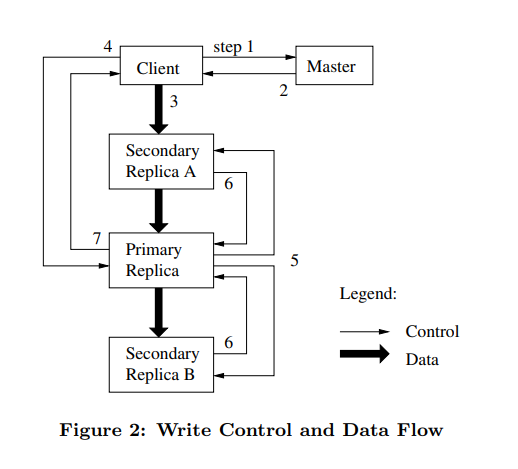

# [The Google File System](http://nil.csail.mit.edu/6.824/2020/papers/gfs.pdf)

*A scalable distributed file system for large distributed data-intensive applications.*
## Introduction

- The design is driven by key observations different from earlier file system assumptions: frequent component failures, huge files (GB+), most files are mutated by appending rather than overwriting.
- GFS provides a POSIX-like file system interface. It supports snapshot and record append operations(useful for multi-way merge and consumer/producer).

## Architecture

 Figure 1 

  

- A GFS cluster consists of a single master and multiple chunkservers and is accessed by multiple clients.
- Files are divided into fixed-sized chunks(64 MB, larger than typical) and each chunk has an immutable and globally unique id. Chunkservers store chunks as local Linux files and the master maintains all file system metadata.
- The master stores in memory three majors types of metadata: the file and chunk namespaces, the mapping from files to chunks and the locations of each chunk's replicas. The first two are also persisted in a replicated operation log(with checkpoints); the last one is polled from chunkservers at start time and kept up-to-date via heartbeat messages.
- **Reads**
  1. Using the fixed chunk size, the client translates the file name and byte offset into a chunk index within the file.
  2. Sends the master a request containing the file name and chunk index. 
  3. The master replies with the corresponding chunk handle and locations of the replicas. 
  4. The client caches this information using the file name and chunk index as the key.
  5. The client then sends a request to one of the replicas,most likely the closest one. The request specifies the chunk handle and a byte range within that chunk. Further reads
of the same chunk require no more client-master interaction until the cached information expires.

### Chunk Size
- Key design parameters, Large chunk chosen : 64MB
- **Advantages**
  - Reduces clients' need to interact with the master
  - Operations are more likely to target at the same chunk, can reduce network overhead by keeping a persistent TCP connection to the chunkserver over an extended period of time
  - Reduces metadata size, easier for master to store in memory
- **Disadvantages**
  - Small files -> small # of chunks -> the chunkserver becomes a hot spot

### Operation Log

- Contains a historical record of critical metadata changes. Replicated on multiple remote machines.
- Respond to a client operation only after flushing the corresponding log record to disk both locally and remotely.
- Recovers file system by replaying the log.
- Master checkpoints its state in a compact B-tree like form whenever the log grows beyond a certain size.
- Only keeps latest complete checkpoint and subsequent log files.
  

 Figure 2 

  

## System Interactions

### Leases and Mutation Order

- For mutations to a chunk, the master grants an extendable chunk lease to one of the replicas. The primary will pick a serial order for all mutations to the chunk and all replicas will follow this order.
- Control and data flows are decoupled to use the network efficiently. Control flows from the client to the primary and then to all secodaries. Data is pushed linearly along a carefully picked chain of chunkservers in a pipelined fashion.
- GFS provides at-least-once semantics. A client retries when mutation fails, so replicas of the same chunk may contain different data including duplicates or paddings(not bytewise identical).
- **Writes**
  1. Client asks the master which chunkserver holds the current lease for the chunk and replica locations.
  2. Master replies with primary and secondaries locations. Caches this until primary unavailable/no longer has lease.
  3. Client pushes the data to all the replicas. Each chunkserver will store the data in an internal LRU buffer cache.
  4. After all the replicas ack, client sends a write request to the primary. Primary assigns write order to all mutations it receives.
  5. Primary forwards the write request to all secondary replicas with mutation order.
  6. Secondaries ack to primary on completion.
  7. Primary replies to client. Failure -> client retry.

## Master Operations

- GFS namespace is represented as a lookup table(with prefix compression) from full pathnames to metadata. Each file or directory has a read-write lock to ensure proper searialization.
- The master create chunk replicas for initial creation, re-replication and rebalancing. It considers various factors when placing the replica, to maximizing data reliability/availability/network bandwidth utilization.
- When a file is deleted, the master logs the deletion immediately but deletes metadata after some delay(3 days, etc). Each chunkserver reports a subset of chunks in heartbeat messages, and the master replies whether these chunks can be deleted. This lazy approach is simple and reliable in a large-scale distributed system.
- The master maintains a version number for each chunk. Whenever the master grants a new lease on the chunk, it increases the version number and informs all the up-to-date replicas.
- For high availability, we have (1) monitoring infrastructure outside GFS to start a master and (2) "shadow" masters for read-only operations.

## Fault Tolerance

- **High Availability**
  - Fast Recovery - Both the master and the chunkserver are designed to restore their state and start in seconds.
  - Chunk Replication - default 3 replications per chunk.
  - Master Replication - Operation log and checkpoints replicated on multiple machines. "Shadow" masters above.
- **Data Integrity**
  - Breaks each 64 MB chunk into blocks of 64 KB, each with its own 32-bit checksum stored in memory and written to the log.
  - For reads, the chunkserver verifies the checksum of datablocks that overlap the read range before returning any data to the requester
    - If a block does not match the recorded checksum, the chunkserver returns an error and and reports the mismatch to the master. 
    - In response, the requestor will read from other replicas, while the master will clone the chunk from another replica. 
    - After a valid new replica is in place, the master instructs the chunkserver that reported the mismatch to delete its replica.
     
## Summary

- **Good Ideas**
  - High Availability through fast recovery of master and chunkserver.
  - Separation of naming (master) from storage (chunkserver).
  - Sharding (chunk replication) for parallel throughput.
  - Primary to sequence writes.
  - Leases to prevent split-brain chunkserver primaries.
- **Not So Good**
  - Single master performance : Ran out of RAM and CPU as file count increased 1000x
  - Chunkservers not very efficient for small files
  - Lack of automatic fail-over to master replica
